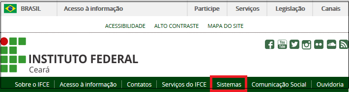
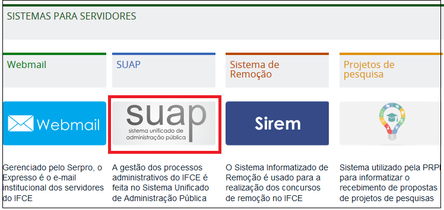

# Como acessar o SUAP ?
O SUAP pode ser acessado de duas formas: 

## Forma de acesso nº 1: Acesso pelo Portal do IFCE

a) Abra seu navegador e digite o endereço: [http://www.ifce.edu.br](http://www.ifce.edu.br)

b) Estando no sítio do IFCE, clicando no link “Sistemas” no topo da página (Figura 1). 

>**Figure 1:** Acesso ao SUAP pelo sítio do IFCE

c) Na página que abrirá, clique no ícone SUAP, localizado na área “Sistemas para Servidores” (Figura 2)

>**Figure 2:** Acesso ao SUAP pelo sítio do IFCE

## Forma de acesso nº 2: Acesso direto ao sistema

a) Abra seu navegador e digite o endereço: [http://suap.ifce.edu.br](http://suap.ifce.edu.br)
Navegadores Web Recomendados

O SUAP pode ser acessado pelos navegadores **Mozilla Firefox** e Google Chrome.

Entretanto, a equipe do SUAP recomenda a utilização do Mozilla Firefox por apresentar melhor compatibilidade com o sistema.

O SUAP não é compatível com Internet Explorer. 