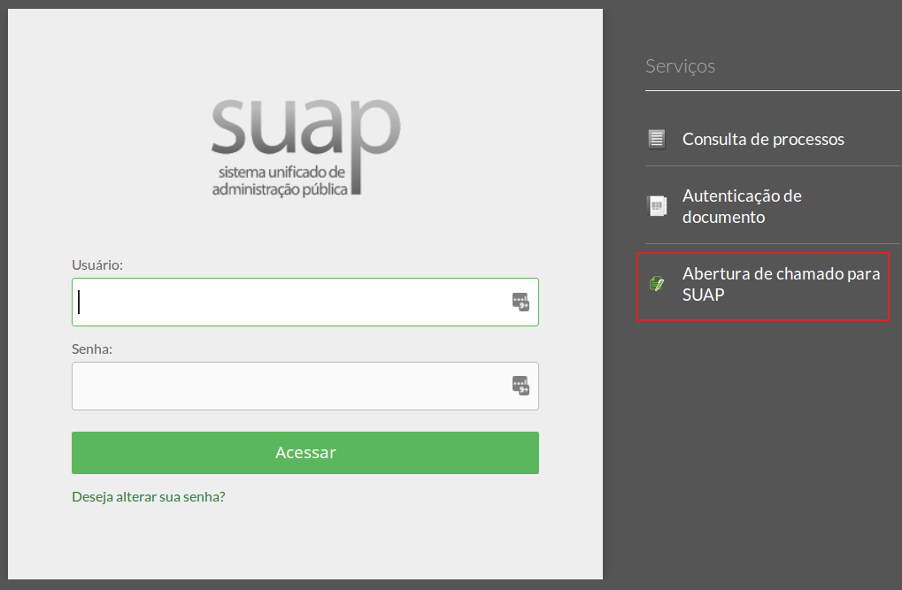

# SUAP - Como entrar em contato para obter suporte?

## Formulário eletrônico de contato

A equipe de suporte ao Sistema SUAP pode ser contatada pela página do [suporte](https://ifce.edu.br/centraldeatendimento)

Outra forma de acessar o formulário é através de um clique opção “Abertura de chamado para o SUAP” na tela de login do SUAP (Figura 1):

>**Figure 1:** Opção “Abertura de chamado para o SUAP”

Você será redirecionado para a seguinte página (Figura 2) 

>**Figure 2:** Formulário para contato com a equipe do SUAP

## Instruções para o preenchimento do formulário

a) Leia atentamente as instruções contidas na tela.

b) Preencha os campos: **Nome**, **Email**, **Campus e Setor**.

c) Em **“Tipo de Solicitação”**, selecione uma das opções disponíveis na opção **SUAP**. São elas:

Alteração de email para recuperação de senha
* Lotação em setor/Campus
* Requisitar acesso ao módulo de Protocolo (Servidor)
* Requisitar acesso ao módulo de Protocolo (Prestador de Serviço)
* Requisitar acesso ao módulo de Almoxarifado
* Requisitar acesso ao módulo de Patrimônio
* Requisitar acesso ao módulo de Frota
* Cadastro de setor no SUAP
* Reportar falhas no sistema
* Informar problemas de acesso ao SUAP
* Outros

d) Quando solicitado, preencha o campo **“Mensagem”** com os dados solicitados, como:

   **Matrícula SIAPE:** Preencher onde tem a mensagem `INSIRA_SEU_SIAPE_AQUI`
   
   **Email Institucional:** (Preencher onde tem a mensagem `INSIRA_SEU_SIAPE_AQUI`
   
   **Perfil de Acesso:** (Marcar uma das opções exibidas)

e) Se prestador de serviço, informar também (quando solicitado):

* **Nome Completo:** Preencher onde tem a mensagem `INSIRA_SEU_SIAPE_AQUI`
* **CPF:** Quando prestador de serviço, preencher onde tem a mensagem `INSIRA_SEU_SIAPE_AQUI`

f) Caso haja a necessidade de enviar anexos como planilhas, imagens e outros tipos de documentos, utilize a opção Escolher arquivos para anexá-los a sua solicitação. 

## Para onde as solicitações serão enviadas?

As solicitações emitidas pelo formulário eletrônico são encaminhadas para um sistema de Help Desk interno da DGTI

Nele estarão contidos todos registros e os acompanhamentos das ocorrências de suporte.

Para cada solicitação, será aberto um tíquete com uma identificação única, a ser enviada ao e-mail repassado no formulário.

Por meio dele, o usuário poderá obter informações sobre o seu atendimento.

## Horário de funcionamento do setor

|    Periódo   |    Horário |
|-----|-----|
Manhã| 08h00 às 11h30|
|Tarde| 12h30 às 17h00|

:::warning Prazo médio de atendimento:
8 horas úteis (observando o horário de funcionamento do setor)
:::

:::warning Prazo de atendimento para urgência: 
4 horas úteis para urgência comprovada (observando o horário de funcionamento do setor)
:::

**Obs:** O prazo de atendimento refere-se a análise da demanda, após a realização dessa atividade um profissional entrará em contato informando o prazo para a solução do problema