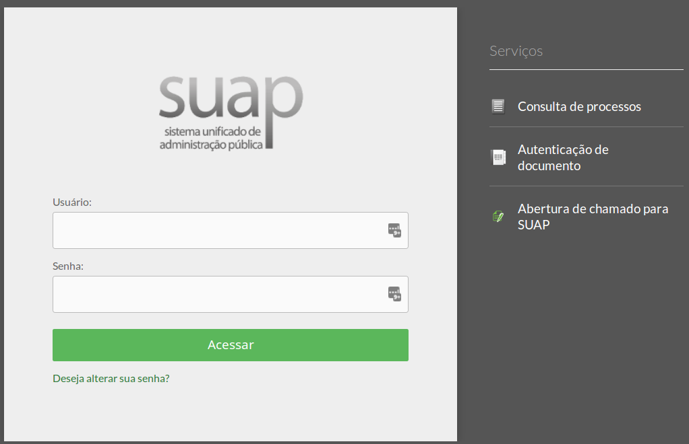

# Como se logar no SUAP?

>**Figure 1:** Tela de login do SUAP

Há três perfis de usuário que podem fazer o login no sistema. São eles: 

 
## Servidor:

  * No campo “Username” digitar o número de matrícula do SIAPE.
  * No campo “Senha” digitar a senha de acesso ao sistema.

## Estagiário:

  * No campo “Username” digitar o número de matrícula do SIAPE.
  * No campo “Senha” digitar a senha de acesso ao sistema.

## Prestador de serviço/terceirizado:

  * No campo “Username” digitar o número do CPF.
  * No campo “Senha” digitar a senha de acesso ao sistema.