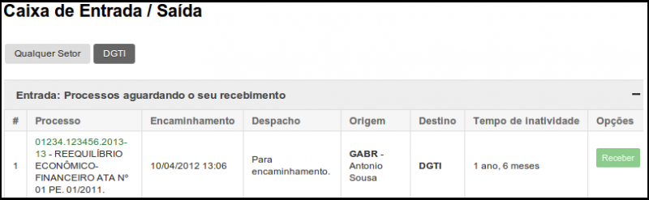
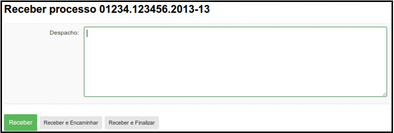
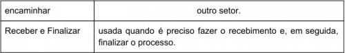
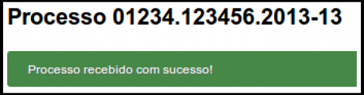
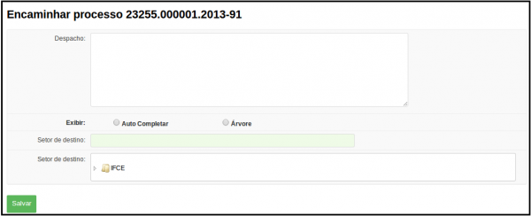
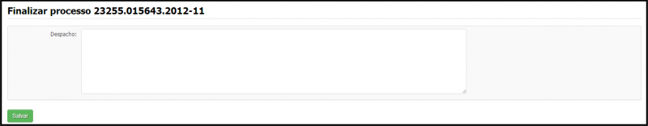

# SUAP/Protocolo/Manual do Usuário/Caixa de entrada e saída
## Caixa de entrada e saída

Nessa página podemos visualizar todos os processos que estão aguardando o recebimento ou o encaminhamento (Figura 1). Ao clicarmos no botão “Receber” somos redirecionados para a página de recebimento de processo (Figura 2):

 >**Figura 1:** Caixa de entrada/saída
 

 >**Figura 2:** Receber processo 
 
 Nela, precisamos colocar o despacho e temos a opção temos três opções:
 
 >**Figura 3** Botões ­ Receber processo
 
 Ao selecionar a opção ​Receber​ uma mensagem confirmará o recebimento (Figura 4):
 
 >**Figura 4** Processo recebido com sucesso 
 
 Ao ​Receber e Encaminhar​ somos direcionados para a página a seguir (Figura 5):
 
 >**Figura 5** Receber e encaminhar
 
Onde preenchemos da mesma maneira de quando criamos o processo (preenchendo o despacho e selecionando o setor na árvore) e sem seguida, clicamos no botão “Salvar”. Ao clicar em ​Receber e Finalizar somos direcionados para a página a seguir (Figura 6):

>**Figura 6** Receber e finalizar 