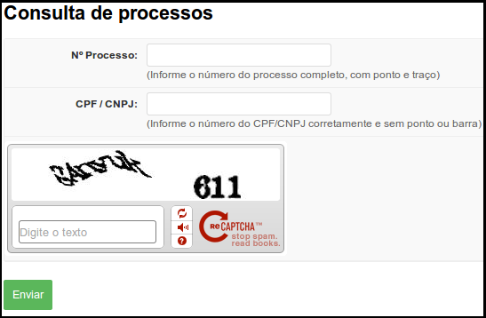

# Protocolo/Manual do Usuário/Consulta a processos

## Passo-a-passo

Acesse o SUAP no endereço [http://suap.ifce.edu.br](http://suap.ifce.edu.br), e clique na opção “Consulta de Processos” (Figura 1)

>**Figure 1:** Menu “Consulta de processos” na tela de login do SUAP

Através desta opção uma pessoa, seja física ou jurídica, pode consultar o trâmite de seu processo. Para isso ela precisa informar o número do processo e o CPF ou o CNPJ do interessado. 

>**Figure 2:** Consulta de processos