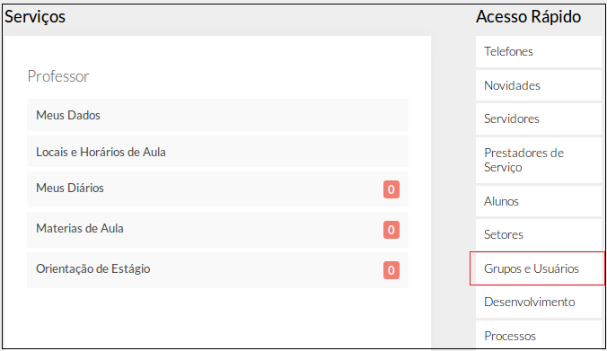
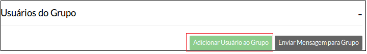

# SUAP/Protocolo/Manual do Usuário/Perfis de acesso

## a) Visão geral
| Grupo | Descrição | Destinado a |
| :--------| :---------| :-----------|
| Visualizador de processos | Perfil   destinado   aos   usuários   que   precisam  visualizar os processos, apenas. | todos os servidores |
| Tramitador de processos | Perfil   destinado   aos   usuários   que   precisam  visualizar, editar e tramitar processos. | todos os servidores |
| Cadastrador de processos | Perfil   destinado   ao   usuário   responsável   pelo  cadastramento,   visualização,   edição   e   tramitação   de   processos. | Recepcionistas ou servidores do setor de protocolo de cada campus. |

## b) Atribuindo os perfis do módulo de Protocolo a um usuário

Na tela inicial, clique na opção “Grupos e Usuários”, localizado no lado direito da tela (Figura 1)

>**Figure 1:** Menu “Grupos e Usuários”

Na tela **“Gerenciar Grupos e Usuários”**, selecione o módulo **“protocolo”** (Figura 2).

>**Figure 2:** Selecionar módulo “Protocolo”

Clique na aba contendo o perfil desejado (por exemplo, **Cadastrador de Processos**) (Figura 3)

>**Figure 3:** Perfis do módulo Almoxarifado

Clicar no botão Adicionar usuário ao grupo (Figura 4)

Procure o usuário pelo nome ou pela matrícula SIAPE (Figura 5) 
[adicionar_usuario_form](..images/adicionar_usuario_form.png)
>**Figure 5:** Localizar usuário

Selecione o usuário clicando nos seus dados e confirme. 