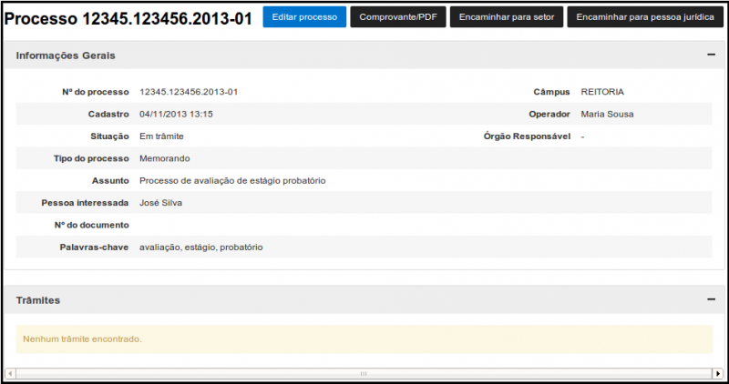
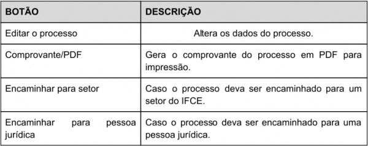
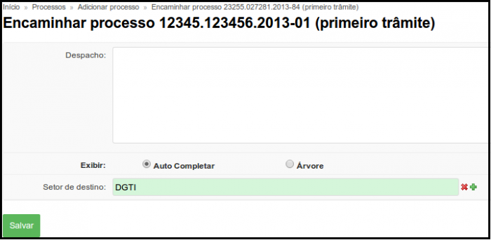
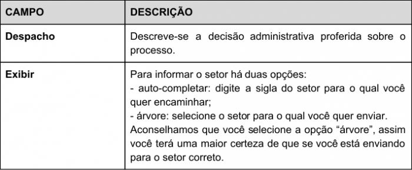
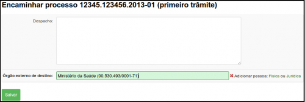
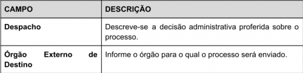
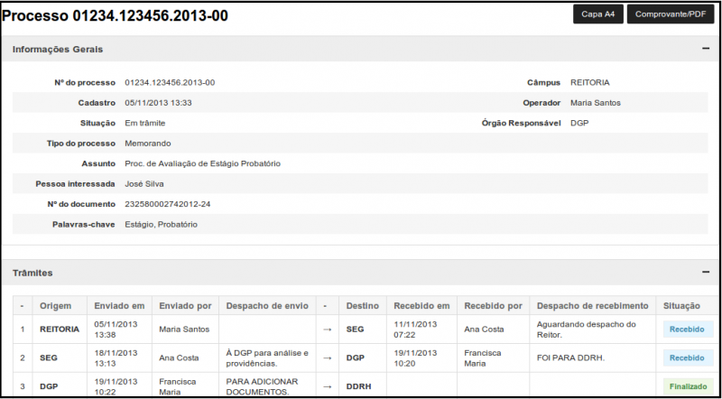
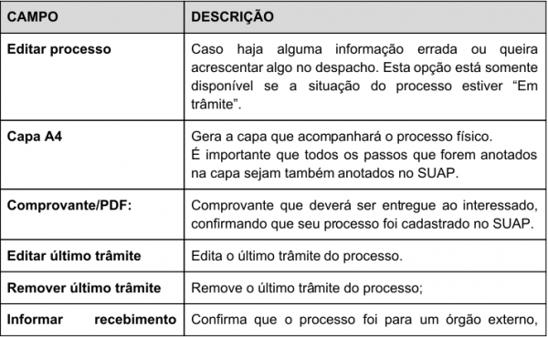

# SUAP/Protocolo/Manual do Usuário/Tramitação

## passo-a-passo

Tramitar corretamente é fundamental para agilizar o andamento do processo. Este passo depende de como a opção “Primeiro trâmite” foi selecionada durante o preenchimento do processo.

* Se na caixa de seleção “Primeiro trâmite” a opção “Nenhum” for selecionada Será exibida a tela de visualização dos dados do processo (Figura 1).

>**Figura 1:** Processo sem trâmite

No topo da tela há quatro botões:

>**Figura 2:** Botões ­ processo sem trâmite

* Se na caixa de seleção “Primeiro trâmite” a opção “Órgão Interno” for selecionada Será exibida a tela em que você pode enviar o processo para qualquer setor em qualquer ​campus ​do IFCE (Figura 3).

>**Figura 3:** Encaminhar processo para órgão interno

>**Figura 4:** Campos de encaminhamento de processo para orgãos internos

* Se na caixa de seleção “Primeiro trâmite” a opção “Órgão Externo” for selecionada A figura 4 apresenta a tela de envio de processo para qualquer órgão externo ao IFCE. 

>**Figura 5:** Encaminhamento de processo para órgão externo

>**Figura 6:** Campos de encaminhamento de processo para orgãos externos

* Após clicar no botão “Salvar”, em qualquer uma das duas últimas opções (trâmite ou órgão interno), você será redirecionado para a página a seguir (Figura 6)

>**Figura 7:** Processo

* Atente que, após o cadastro do processo, foi gerado um número de protocolo. Guarde­o, pois pode ser necessário para consultas futuras.

* No topo da tela há os seguintes botões:

>**Figura 8:** Botões ­ Resumo processo salvo