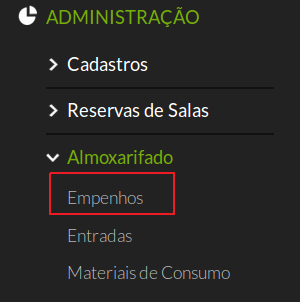
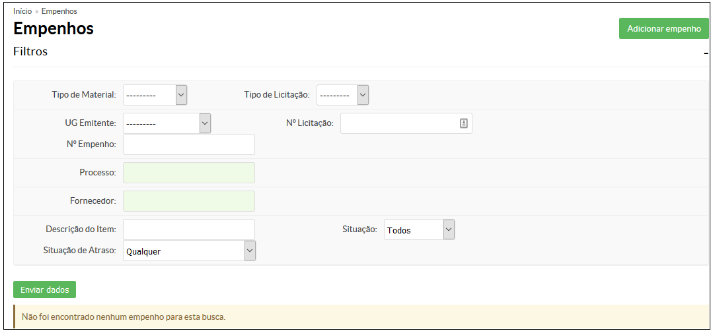
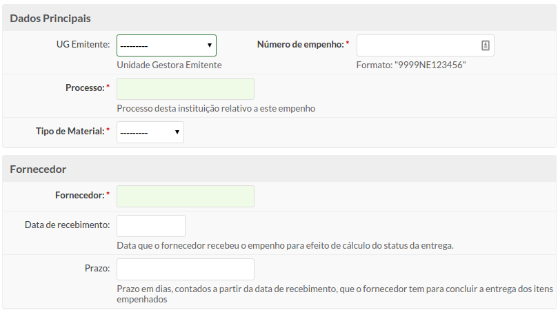
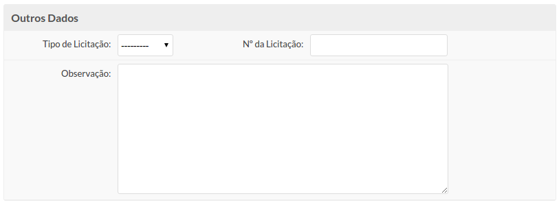
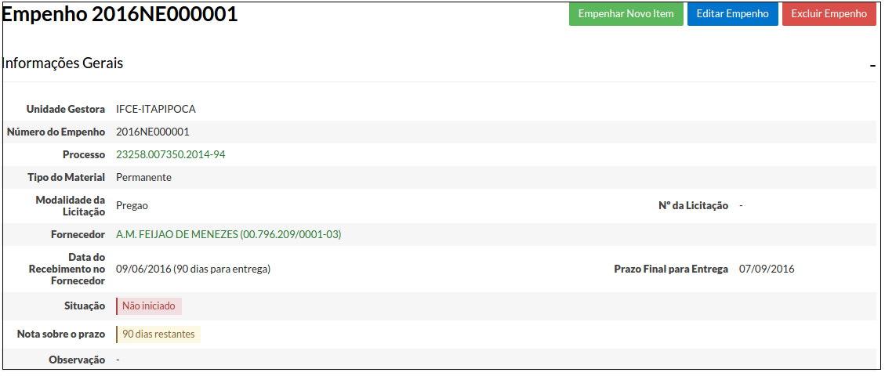

# 5.1 SUAP/Almoxarifado - Cadastrar empenho

## 5.1.1 Conceitos

|Conceito|Definição|
| :------| :-------|
|**Empenho**| Ato emanado de autoridade competente, que cria para o estado a obrigação de pagamento pendente ou não de implemento de condição; (Fonte: Lei n. 4.320/64). É a garantia de que existe o crédito necessário para a liquidação de um compromisso assumido; É o primeiro estágio da despesa pública.|
|**Material de Consumo** | aquele que, em razão de seu uso corrente e da definição da Lei n. 4.320/64, perde normalmente sua identidade física e/ou tem sua utilização limitada a dois anos (Fonte: Portaria STN nº 448/02)|
|**Material Permanente** | aquele que, em razão de seu uso corrente, não perde a sua identidade física, e/ou tem uma durabilidade superior a dois anos. (Fonte: Portaria STN nº 448/02)|
|**Licitação** | destina-se a garantir a observância do princípio constitucional da isonomia, a seleção da proposta mais vantajosa para a administração e a promoção do desenvolvimento nacional sustentável e será processada e julgada em estrita conformidade com os princípios básicos da legalidade, da impessoalidade, da moralidade, da igualdade, da publicidade, da probidade administrativa, da vinculação ao instrumento convocatório, do julgamento objetivo e dos que lhes são correlatos. (Fonte: Lei nº 8.666/93) |

## 5.1.2 Perfis de acess

A funcionalidade **Adicionar empenho** está disponível para usuários pertencentes aos seguintes perfis de acesso:

  - Coordenador de almoxarifado do campus
  - Coordenador de almoxarifado sistêmico
  - Operador de almoxarifado do campus

## 5.1.3 Pré-requisitos

É necessário que, antes de cadastrar o empenho, seja atendidos os seguintes pré-requisitos:
  * Cadastro do processo relativo através do módulo de Protocolo. Portanto este módulo deve estar em funcionamento para que a utilização do módulo de Patrimônio tenha prosseguimento. [Clique aqui para maiores informações sobre como cadastrar processos](/guides/suap/models/protocolo_manual_do_usuario_cadastro_do_processo.html)
  * Ter em mãos uma cópia da Nota de Empenho a ser cadastrada.
  
## 5.1.4 Procedimento de cadastro de empenho

Após o cadastro do processo, clique no menu **“Administração”**, **“Almoxarifado”** e depois na opção **“Empenhos”**(Figura 1).

>**Figure 1:** Acesso à opção “Empenhos”

Será exibida uma tela de listagem de empenhos (Figura 2), onde poderão ser consultados todos os empenhos cadastrados no sistema.

>**Figure 2:** Acesso à opção “Empenhos”

Para adicionar um novo empenho clique no botão “Adicionar Empenho” localizado no canto superior direito da página (Figura 3).

>**Figure 3:** Acesso à opção “Empenhos”

Será exibida uma tela com os campos a seguir (Figura 4).

>**Figure 4:** Adicionar Empenho

Nessa tela deverão ser informados os seguintes campos:

| Campo | Descrição  Obrigatório |
| :-----| :---------| :-----------|
| **UG Emitente** | Corresponde a Unidade Gestora Emitente (ex: IFCE-REITORIA, IFCE-FORTALEZA, IFCE-SOBRAL). | SIM |
| **Número do Empenho** | O número que consta na nota de empenho e tem o seguinte formato: AAAANEXXXXXX, onde “AAAA” é o ano de criação do empenho e “XXXXXX” são seis números que representam a ordem sequencial dos empenhos. | SIM |
| **Processo** | Processo da instituição, aberto no módulo Protocolo. | SIM |
| **Tipo de material** | Deverá ser informado se o material é de consumo ou permanente. | SIM |
| **Fornecedor** | Nome do fornecedor referente ao empenho. | SIM |
| **Data de recebimento** | Data que o fornecedor recebeu o empenho para efeito de cálculo do status da entrega. | NÃO |
| **Prazo** | Prazo em dias,contados a partir da data de recebimento, que o fornecedor tem para efetuar a entrega dos itens empenhados. | NÃO |
| **Tipo de Licitação** | Dispensa, Pregão, Srp (Sistema de Registro de Processos), Inex (Inexibilidade de Licitação). | NÃO |
| **N° da Licitação** | Especifique o número da licitação. | NÃO |
| **Observação** | Observações pertinentes à licitação. | NÃO |

Concluído o preenchimento dos campos, escolha um dos três botões abaixo:

|       |           |
| :-----| :---------|
|**Salvar:**|para salvar e concluir o cadastro.|
|**Salvar e adicionar outro(a):**|para salvar e cadastrar outro empenho;|
|**Salvar e continuar editando:**|para salvar e continuar editando o Empenho atual;|

Após efetuado o cadastro você será redirecionado para a página a seguir (Figura 5):

>**Figure 5:** Finalização do cadastro do empenho

No topo serão exibidos três botões:

|       |           |
| :-----| :---------|
|**Empenhar novo item**| Usado para adicionar os bens de consumo ou permanentes que fazem parte do empenho. Uma vez que o empenho foi cadastrado é necessário lançar os itens de empenho, cuja operação é apresentada a seguir.|
|**Editar Empenho**| Usado para alterar algum dado do empenho|
|**Excluir empenho**| Usado para remover o empenho |
