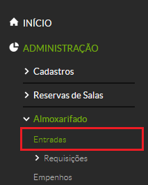

# 5.6. SUAP/Almoxarifado - Registrar entrada de material (Compra)

## 5.6.1 Conceitos

|Conceito|Definição|
| :------| :-------|
|COMPRA| modalidade de aquisição remunerada de um bem, para fornecimento de uma só vez ou parcelado, à vista de documento comprobatório próprio (nota fiscal, fatura ou outro documento fiscal equivalente) e vinculado a Nota de Empenho (NE) regularmente emitida; (Fonte: Manual de Gestão de Materiais do IFCE) |

## 5.6.2 Cadastrar entrada de material (compra)

Para cadastrar uma entrada de material, clique no menu **“Administração”**, menu **“Almoxarifado”**, em seguida clique em **“Entradas”** (Figura 1).

>**Figure 1:** Menu entrada de material

Na tela seguinte, clique no botão “Adicionar Compra” (Figura 2).

>**Figure 2:** Menu entrada de material

Será exibido o seguinte formulário (Figura 3).

>**Figure 3:** Menu cadastrar compra

| Campo | Descrição | Obrigatório |
| :------| :-----------| :-------|
| Campus: | Campus do servidor que está efetuando o lançamento da compra. Este campo é preenchido automaticamente | SIM |
| Data Entrada: | Os bens ao ingressarem no almoxarifado mediante compra deverão estar acompanhados de uma nota fiscal. Aqui é informada a data da chegada da nota fiscal. | SIM |
| Tipo de Entrada: | Compra. Este campo é preenchido automaticamente | SIM |
| Empenho: | Número do empenho. | SIM |
| Fornecedor: | Fornecedor do material (fornecido automaticamente após inserido o número do empenho). | SIM |
| N° Nota Fiscal: | Número da Nota Fiscal. É possível digitar mais de um número de nota fiscal, separando-os por ponto-e-vírgula (ex: 31012;315016). | SIM |
| Data Nota Fiscal: | Data do ateste da Nota Fiscal | SIM |

Após preencher os campos acima, uma nova tela será exibida, em que serão apresentados os itens do empenho e será perguntado a quantidade de itens a serem recebidos.

>**Figure 4:** Quantidade recebida da compra

Ao clicar no botão **“Efetuar”** será exibida uma tela informando que a entrada foi realizada e duas opções: HTML e PDF, que deverão ser escolhidas para gerar um relatório da entrada em HTML (para ser aberta no seu navegador) ou, em PDF (para ser aberta no formato de arquivo PDF), respectivamente.
