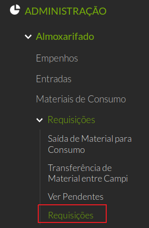
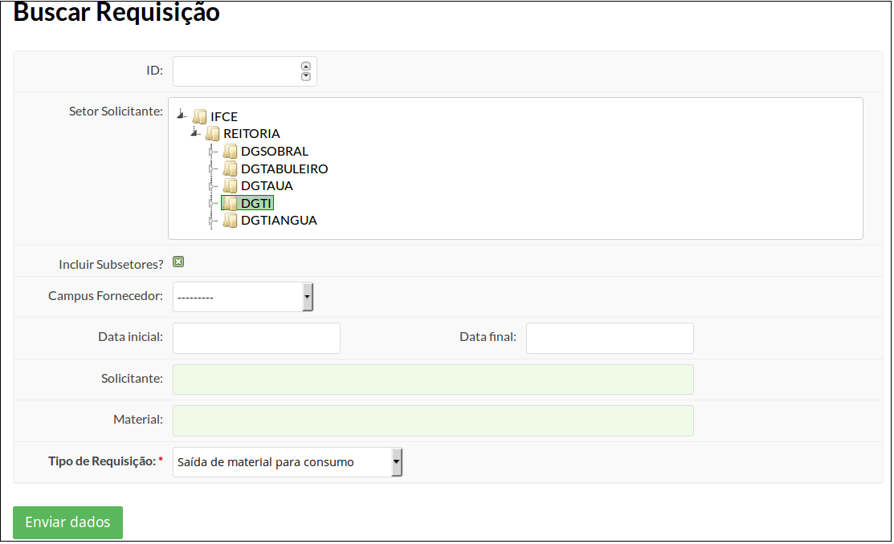
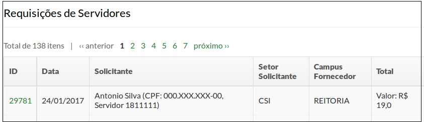
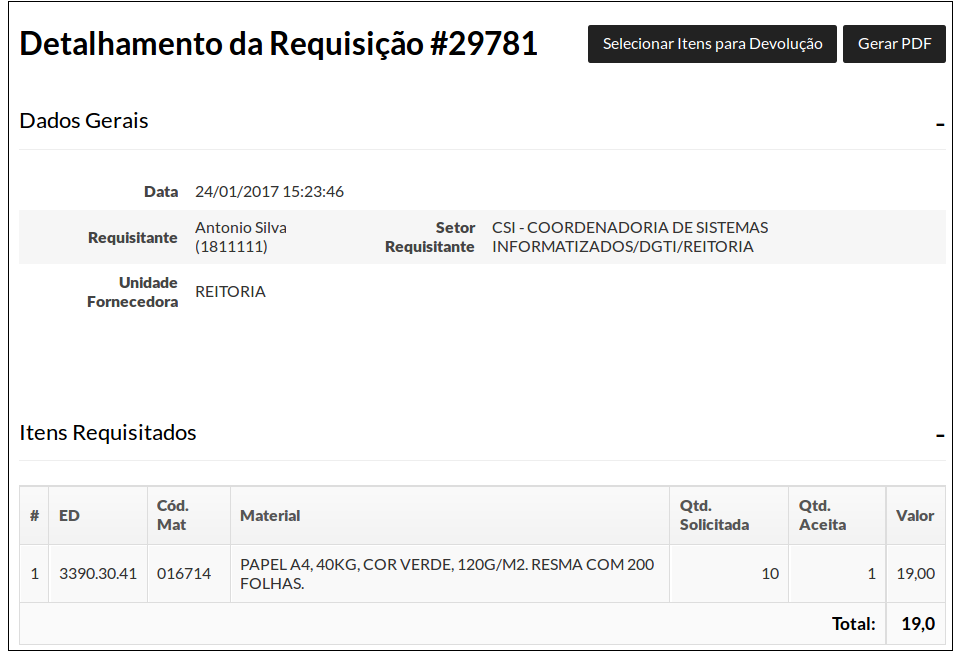
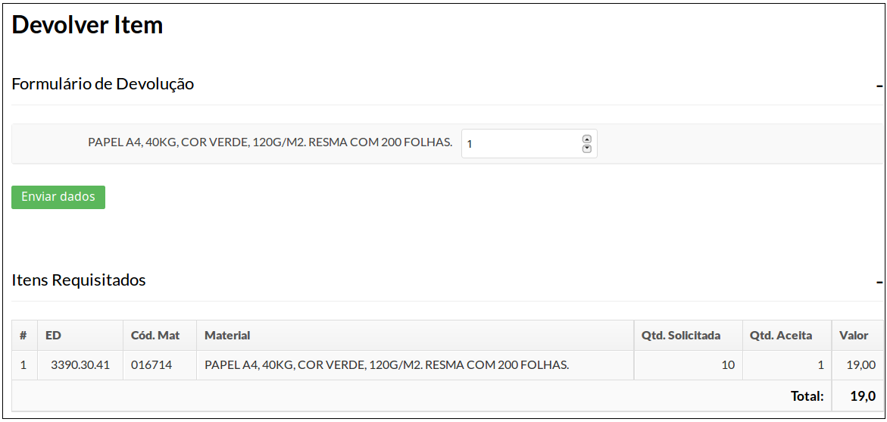

# 5.10. SUAP/Almoxarifado - Devolução de material

Para que o servidor possa devolver um material, ele deve primeiramente localizar a requisição.

Para isso, acesse o menu ADMINISTRAÇÃO, clicar no menu Almoxarifado, clicar a opção Requisições e por último clicar em Requisições. (Figura 1)

>**Figure 1:**

 O menu redirecionará ao formulário a seguir (Figura 2):
 

 >**Figure 2:**
 
A busca pode ser feita por meio dos seguintes campos:

| **ID** | número da requisição |
| :------| :--------------------|
| **Incluir Subsetores?** | Deixe marcado |
| **Campus Fornecedor** | - |
| **Data inicial** | - |
| **Data final** | - |
| **Solicitante** | - |
| **Material** | - |
| **Tipo de Requisição** | [Saída de material para consumo] ou [Transferência de Material entre campi] |

Escolha um ou mais critérios que melhor facilitem a busca da requisição do material a ser devolvido e clique em **"Enviar dados"**.

A tela será recarregada e, ao final, será exibida a listagem de requisições (Figura 3).

>**Figure 3:**

Clique no número requisição desejada. 

Será feito o redirecionamento para a tela de detalhamento da requisição.
Nesta tela, clique no botão **"Selecionar Itens para Devolução"**, no canto superior direito da tela (Figura 4).

>**Figure 4:**

Aparecerá a tela a seguir (Figura 5):

>**Figure 5:**

Informe a quantidade a ser devolvida e clique no botão **"Enviar Dados"**.

Se deu tudo certo, aparecerá a mensagem **"Itens devolvidos com sucesso"** no topo da tela (Figura 6).

>**Figure 6:**