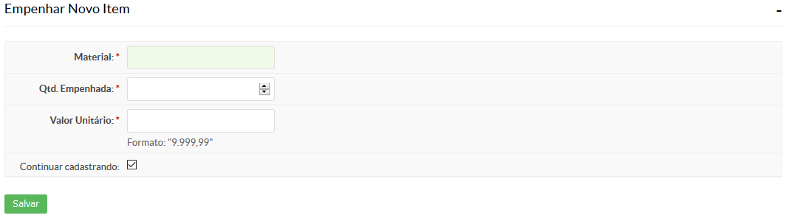
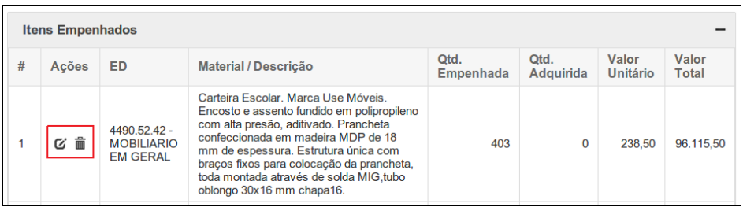

# 5.4. SUAP/Almoxarifado - Empenhar novo item de um empenho de bem de consumo

## 5.4.1 Especificação do bem de consumo

Quando se tratar de descrição de material, deve-se identificar com clareza o item, através da enumeração de
suas características físicas, mecânicas, de acabamento e de desempenho, possibilitando sua perfeita caracterização.

Também deve-se observar ao disposto na Lei 8666/93:

|Art. 14| Nenhuma compra será feita sem a adequada caracterização de seu objeto, sob pena de nulidade do ato e responsabilidade de quem lhe tiver dado causa. |
|Art. 15, Parágrafo 7º | Nas compras deverão ser observadas, ainda: I - a especificação completa do bem a ser adquirido sem indicação de marca;|

Sugere-se, portanto, que a descrição do material contenha:

* O nome do objeto
* Descrição complementar (matéria prima, acabamento, embalagem, dimensões, etc)

**Exemplo de descrição:** 

<code>
ABAIXADOR DE LÍNGUA, MATERIAL MADEIRA, DESCARTÁVEL, 14 CM, FORMATO ESPÁTULA, LARGURA 1,5CM, ESPESSURA 2MM
</code>

## 5.4.2 Adicionar novo item: bem de consumo

O cadastro do item de um empenho é feito clicando no botão Adicionar Novo item.
Será exibida uma tela semelhante a seguir (Figura 1).

>**Figure 1:** Adicionar novo item em um empenho de bem de consumo

| Campo | Descrição | Obrigatório |
| :-----| :---------| :-----------|
| Material | Selecione o bem de consumo desejado ou clique no botão “+” para cadastrá-lo | SIM |
| Qtd empenhada | informe quantos itens serão empenhados | SIM |
| Valor unitário | Informe o valor unitário do bem de consumo. Este valor refere-se ao constante na nota fiscal em atendimento ao Art 18 do Manual de Gestão de Materiais do IFCE. (Art 18:Todo o bem patrimonial adquirido será incorporado ao patrimônio do IFCE, devendo ser registrado no SIAFI **pelo valor constante da nota fiscal, ou pelo valor da avaliação,** de acordo com a classificação a que se vincula no Plano de Contas da Administração Pública Federal, e, obrigatoriamente, registrado no sistema de controle patrimonial[...] ) | SIM |

<code>

**Exemplo:** 

Na nota de empenho há um valor referente à compra de 2 (dois) toners cujo valor total é R$ 688,44. O valor unitário de cada toner é calculado como 688,44 / 2 = R$ 334,22. Então o formulário deve ser preenchido como:

  * Material: TONER PARA IMPRESSORA
  * Qtd empenhada: 2
  * Valor Unitário: 334,22

</code>

:::warning **IMPORTANTE:**

Há casos em que o lançamento por valor unitário apresenta algumas diferenças de centavos. Vamos a um exemplo:

O valor total referente à compra de 3550 canetas foi de R$ 1816,18. O valor unitário da caneta seria de 1816,18 / 3550 = R$ 0,5116, que arredondando para duas casas decimais ficaria R$ 0,51. 
No entanto, caso mutipliquemos R$ 0,51 por 3550 o valor total será R$ 1810,50. Note que haveria uma diferença de R$ 5,68 (R$ 1816,18 – R$ 1810,50).

Para evitar incoerências, vamos dividi-lo em dois lançamentos, cujo valor entre eles variará em R$ 0,01. Para isso vamos utilizar a planilha de ajuste de preços,   disponível para download em [https://drive.google.com/file/d/0B6aMEw0hgmzWOFNRcVpYZl9tYVU/edit?usp=sharing](https://drive.google.com/file/d/0B6aMEw0hgmzWOFNRcVpYZl9tYVU/edit?usp=sharing) (Ajuste de Preços.xlsx).

:::

Exemplo: O valor total referente a compra de 3550 canetas foi de R$ 1816,18. Lançando-o na planilha de ajuste de preços total ficaria:

## 5.4.3 Editar ou excluir itens de um empenho de bens de consumo

Para editar ou excluir um item de um empenho, localize o empenho e clique nos ícones contido na aba **“Ações”** localizada na seção **“Itens empenhados”** (Figura 4):

>**Figure 2:** Empenho - bem de consumo
