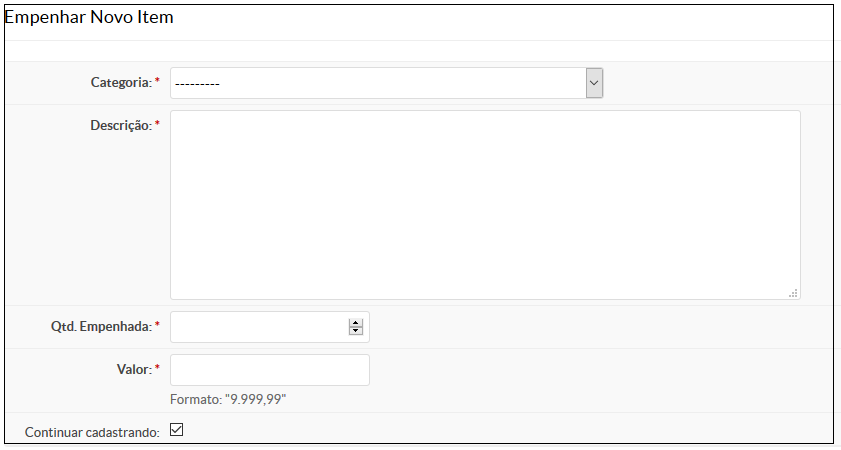
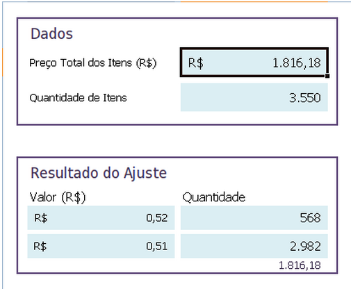

# 5.5. SUAP/Almoxarifado - Empenhar novo item de um empenho de bem permanente

## 5.5.1 Especificação do bem permanente

Quando se tratar de descrição de material, deve-se identificar com clareza o item, através da enumeração de
suas características físicas, mecânicas, de acabamento e de desempenho, possibilitando sua perfeita caracterização.

Também deve-se observar ao disposto na Lei 8666/93:

|           |         |
| :---------| :-------|
|Art. 14| Nenhuma compra será feita sem a adequada caracterização de seu objeto, sob pena de nulidade do ato e responsabilidade de quem lhe tiver dado causa. |
|Art. 15, Parágrafo 7º | Nas compras deverão ser observadas, ainda: I - a especificação completa do bem a ser adquirido sem indicação de marca;|

Sugere-se, portanto, que a descrição do material contenha:

* o nome do objeto
* Descrição complementar (matéria prima, acabamento, embalagem, dimensões, etc)

<code>

**Exemplo de descrição:** 

MESA DE CENTRO COM 01 CUBA DE 500X400X300MM, PROVIDA DE ORIFICIO PARA RECEBER VALVULA TIPO AMERICANA DE DE 3 ½”. COM GANCHEIRA GIRATORIA COM 08 GANCHOS DE 500MM, TOTALMENTE EXECUTADA EM CHAPA DE AÇO INOXIDAVEL AISI 304 LIGA 18.8 BITOLA 18, ESTRUTURADA COM CANTONEIRAS NO MESMO MATERIAL. PES EM TUBO DE AÇO INOXIDAVEL AISI 304 LIGA 18.8 DE 11/2”. SAPATAS DE NIVELAMENTO EM NYLON COM ROSQUEAMENTO EMBUTIDO. CONTRAVENTAMENTO TUBULAR NO MESMO MATERIAL DE 11/4”. SOLDAS EM ATMOSFERA INERTE DE ARGONIO, INVISIVEIS. ACABAMENTO POLIDO FOSCO. DIMENSAO: 2000X700X850MM. MARCA GERACAO.

</code>

## 5.5.2 Adicionar novo item: empenho de bem permanente

O cadastro do item de um empenho é feito clicando no botão Adicionar Novo item.

Será exibida uma tela semelhante a seguir (Figura 1).

>**Figure 1:** Adicionar item em um empenho de bem de consumo

Preencha os seguintes campos:

| Campo | Descrição | OBRIGATÓRIO |
| :---------| :-------| :-------|
| Categoria | Selecione a categoria referente ao bem (vide Anexo I) | SIM |
| Descrição | descreva o item com riqueza de detalhes (podendo informar dados como a marca do produto, componentes, garantia e consumo de energia, por exemplo). | SIM |
| Qtd empenhada | informe quantos itens serão empenhados | SIM |
| Valor | Informe o valor unitário do bem de consumo | SIM |

<code>

**Exemplo:** 

Há na nota de empenho um valor referente a compra de 10 cadeiras de escritório cujo valor total é R$ 5000,00.

O valor unitário da cadeira seria 5000 / 10 = R$ 500,00.

Então o formulário deve ser preenchido como:

  * Categoria: 4490.52.92 – MOBILIÁRIO EM GERAL
  * Descrição: Cadeira Diretor Linha Standart, base giratória com regulagem de altura em 3 estágios, assento e encosto modelo lombar com lamina, flange com relax, telescópio simples em PP, estrela de nylon, rodízios em PP.
  * Qtd empenhada: 10
  * Valor: 500,00

</code>

:::warning **IMPORTANTE:**

Há casos em que o lançamento por valor unitário apresenta algumas diferenças de centavos. Vamos a um exemplo:

O valor total referente à compra de 3550 canetas foi de R$ 1816,18.

O valor unitário da caneta seria de 1816,18 / 3550 = R$ 0,5116, que arredondando para duas casas decimais ficaria R$ 0,51.

No entanto, caso mutipliquemos R$ 0,51 por 3550 o valor total será R$ 1810,50. Note que haveria uma diferença de R$ 5,68 (R$ 1816,18 – R$ 1810,50).

Para evitar incoerências, vamos dividi-lo em dois lançamentos, cujo valor entre eles variará em R$ 0,01. Para isso vamos utilizar a planilha de ajuste de preços,   disponível para download em [https://drive.google.com/file/d/0B6aMEw0hgmzWOFNRcVpYZl9tYVU/edit?usp=sharing](https://drive.google.com/file/d/0B6aMEw0hgmzWOFNRcVpYZl9tYVU/edit?usp=sharing) (Ajuste de Preços.xlsx).

:::

Exemplo: O valor total referente a compra de 3550 canetas foi de R$ 1816,18. Lançando-o na planilha de ajuste de preços total ficaria:

## 5.5.3 Editar ou excluir itens de um empenho permanente

Para editar ou excluir um item de um empenho, localize o empenho e clique nos ícones contido na aba “Ações” localizada na seção “Itens empenhados” (Figura 2):

>**Figure 2:** ícones de edição e exclusão de um item de um Empenho de bens permanentes
