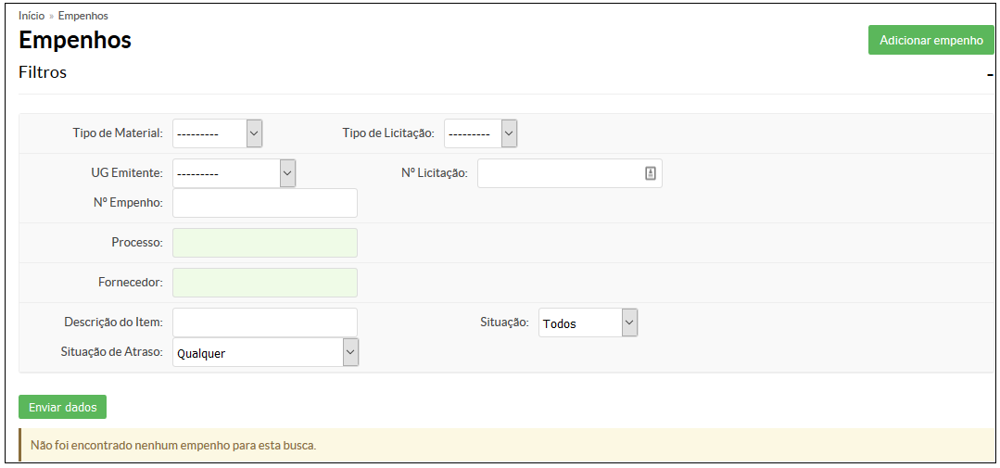

# 5.2 SUAP/Almoxarifado - Listar empenho

## 5.2.1. Pré-requisitos

Para proceder com a listagem de empenhos, é necessário o cadastro prévio de um ou mais empenhos.

## 5.2.2. Perfis de acesso 

A funcionalidade **Listar empenho** está disponível para usuários pertencentes aos seguintes perfis de acesso:

  - Coordenador de almoxarifado do campus
  - Coordenador de almoxarifado sistêmico
  - Operador de almoxarifado do campus

## 5.2.3. Procedimento de listagem de empenho

A realização da listagem do Empenho pode ser feito clicando no menu **Administração**, menu **Almoxarifado** e opção **Empenho** (Figura 1).

>**Figure 1:** Tela de listagem de Empenhos

Você pode listar os empenhos por: 

| Campo | Descrição |
| :-----| :---------|
| Tipo de Material: | Escolha entre as opções: Consumo ou Permanente |
| UG Emitente: | Escolha entre as opções: IFCE-ITAPIPOCA; IFCE-ACARAÚ; IFCE-ARACATI; IFCE-BATURITÉ; IFCE-CAMOCIM; IFCE-CANINDÉ; IFCE-CAUCAIA; IFCE-CEDRO; IFCE-CRATEÚS; IFCE-CRATO; IFCE-FORTALEZA; IFCE-IGUATU; IFCE-JAGUARIBE; IFCE-JUAZEIRO; IFCE-LIMOEIRO; IFCE-MARACANAÚ; IFCE-MORADA; IFCE-QUIXADÁ; IFCE-SOBRAL; IFCE-TABULEIRO; IFCE-TAUÁ; IFCE-TIANGUÁ; IFCE-UBAJARA; IFCE-UMIRIM; IFCE-REITORIA; |
| Nº Empenho: | Preencher com os quatro algarismos do ano, iniciais NE e o número referente ao intervalo definido para a Unidade (Exemplo: 2000NE050000). |
| Tipo de Licitação: | Escolha entre as opções: Dispensa, Pregão, Srp, Inex |
| Nº Licitação: | Preencher com o número da licitação |
| Processo: | Número de processo registrado no módulo de Protocolo. \\ Ao digitar os primeiros números do processo, o sistema disponibilizará as opções existentes, devendo o usuário selecionar aquele desejado. |
| Fornecedor: | Preencher com o nome do fornecedor ou o CNPJ do mesmo. \\ Ao digitar as primeiras letras do nome do fornecedor ou os primeiros números do CNPJ (formato: XX.XXX.XXX/XXXX-XX), o sistema disponibilizará as opções existentes, devendo o usuário selecionar aquele desejado. |
| Descrição do Item: | Preencher com algumas palavras que melhor descrevam o item a ser localizado |
| Status: | Escolha entre as opções: Todos; concluído; não concluído; não iniciado; iniciado;  |
| Situação de atraso: | Escolha entre as opções: qualquer; sem atraso; apenas atrasados; apenas pendentes; apenas concluídos com atraso. |
