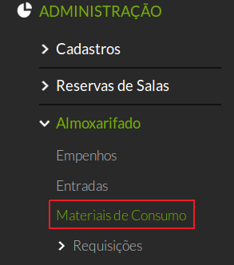
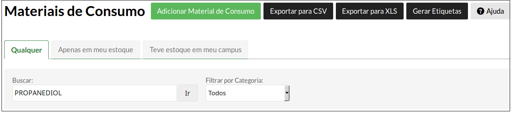

# 5.11. SUAP/Almoxarifado - Material de consumo (busca de material)

## 5.11.1 Perfis de acesso

A funcionalidade **Busca de Material de Consumo** está disponível para usuários pertencentes ao(s) seguinte(s) grupo(s):

  * Coordenador de almoxarifado do campus
  * Coordenador de almoxarifado sistêmico
  * Operador de almoxarifado do campus
  
## 5.11.2 Procedimento de busca de material

Para realizar a busca de um material, clique em **ADMINISTRAÇÃO**, em seguida clique em **Almoxarifado** e depois clique na opção **Materiais de Consumo**.

Na tela que aparece, certifique-se de que a aba **Qualquer** está escolhida. 

Em seguida, clique no campo **Buscar** e preencha com o nome do material (aperte **ENTER** ou clique no botão **Ir**).

A busca também pode ser filtrada através das abas **Apenas em meu estoque** e **Teve estoque em meu campus**
