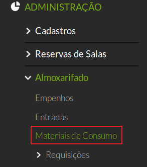
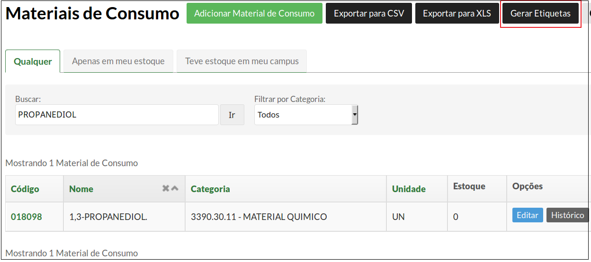
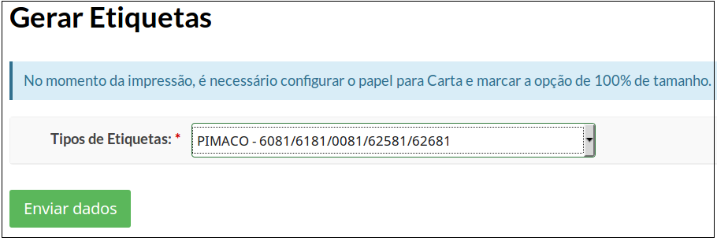

# 5.13. SUAP/Almoxarifado - Material de consumo (geração de etiquetas)

## 5.13.1 Introdução

A etiqueta é utilizada para ser anexada ao material a ser entregue ao servidor responsável.

## 5.13.2 Perfis de acesso

A funcionalidade **Gerar etiqueta do Material** está disponível para usuários pertencentes ao(s) seguinte(s) grupo(s):

  * Coordenador de almoxarifado do campus
  * Coordenador de almoxarifado sistêmico
  * Operador de almoxarifado do campus

## 5.13.3 Procedimento de geração de etiquetas

Clique em **ADMINISTRAÇÃO**, em seguida clique em **Almoxarifado** e depois clique na opção **Materiais de Consumo**.

Na tela que aparece, clique no campo **Buscar** e preencha com o nome do material cuja etiqueta será impressa (aperte **ENTER** ou clique no botão **Ir**).

Após ter feita a busca, o próximo passo é clicar no botão **Gerar Etiquetas**, localizado no canto superior direito da tela.

Você será redirecionado para o formulário de seleção de etiquetas.

Selecione o tipo de etiqueta e clique no botão **"Enviar dados"**. A etiqueta será gerada em formato .pdf.