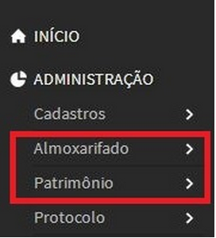

# 3.6 SUAP/Almoxarifado - Menus Almoxarifado e Patrimônio

Na lateral esquerda da aplicação encontra-se o menu principal. Clicando em **“Administração”** você terá acesso aos módulos de **“Almoxarifado”** e **“Patrimônio”**. Caso estes não estejam aparecendo é porque o acesso ao usuário não foi liberado. Neste caso entre em contato com o suporte do SUAP (Figura 1).

>**Figure 1:** Acesso aos módulos Almoxarifado e Patrimônio