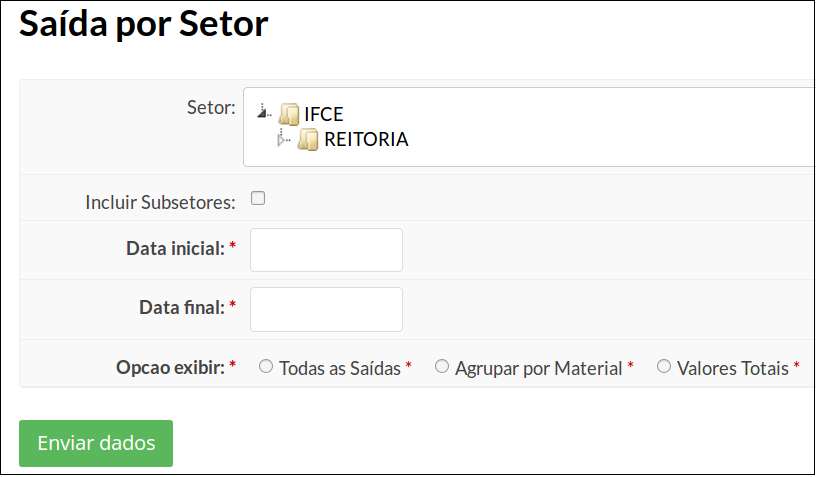
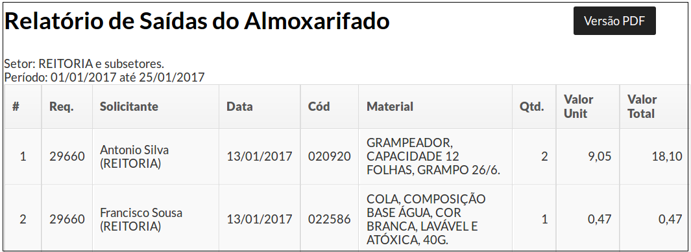
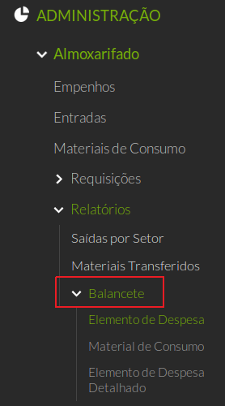
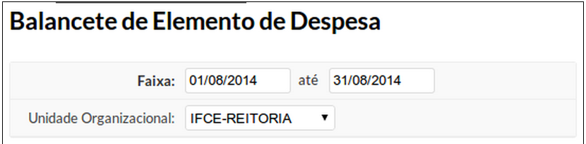
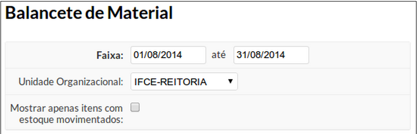
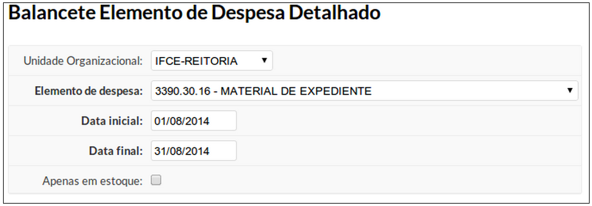

# 5.14. SUAP/Almoxarifado - Relatórios

A geração de relatórios do módulo Almoxarifado pode ser feita indo no menu **ADMINISTRAÇÃO**, **Almoxarifado**, **Relatórios**.

## 5.14.1. Saídas por Setor

O relatório Saída por Setor permite verificar os materiais e valores que cada setor recebeu do almoxarifado. 

Clique no menu **ADMINISTRAÇÃO**, **Almoxarifado**, **Relatórios**, **Saídas por Setor**. Será apresentada a tela a seguir.

Um formulário será aberto, onde é possível definir critérios de pesquisa.

| CAMPO | DESCRIÇÃO |
| :-----| :---------|
| **Setor** | setor para o qual será gerado o relatório. Caso seja necessário incluir os subsetores, marque a opção Incluir Subsetores.|
| **Data inicial** | período inicial|
| **Data final** | período final|
| **Opção exibir** | Todas as Saidas, Agrupar por Material, Valores Totais |

No organograma de setores, selecione o setor para o qual deseja analisar as saídas de material.

Defina o intervalo de tempo que as saídas foram realizadas, por meio dos campos **Data Inicial** e **Data Final**.

Defina também o tipo de agrupamento dos dados (**todas as saídas**, **agrupar por material**, **valores totais**).

Caso deseje é possível incluir subsetores na busca selecionando o campo **Incluir Subsetores**. 

Terminado de preencher as informações clique no botão **Enviar dados**

Será aberto o relatório solicitado, caso queira é possível gerar um PDF do relatório selecionando o botão “Versão PDF” localizado na parte superior do relatório.

## 5.14.2. Materiais Transferidos

O relatório **Materiais Transferidos** permite verificar todos os produtos que foram transferidos para um determinado campus.

Acesse o menu **ADMINISTRAÇÃO**, **Almoxarifado** → **Relatórios** → **Materiais Transferidos**.

No formulário que será exibido, informe a data inicial e final e o servidor que realizou a solicitação. 

Após informar os dados clique no botão **Enviar dados**.

## 5.14.3 Totalização por Elemento de Despesa por Período de Entrada

## 5.14.4 Balancete

O Balancete é um relatório que permite verificar os lançamentos efetuados no almoxarifado. 

Através dos lançamentos realizados é possível verificar se existe divergência entre os lançamentos e o estoque do almoxarifado.

Os relatórios de Balancete estão disponíveis ao clicar no menu **ADMINISTRAÇÃO**, **Almoxarifado**, **Relatórios**, **Balancete**. 

Poderão ser visualizadas as seguintes opções: 
  * Elemento de despesa;
  * Material de Consumo;
  * Elemento de despesa detalhado;

### 5.14.4.1 Balancete de Elemento de Despesa

O balancete de elemento de despesa exibe um relatório com valores agrupados por elementos de despesa (categoria de materiais).
Para cada categoria são informados o estoque anterior, as entradas, as saídas e o estoque atual.

Para acessar o Balancete por Elemento de Despesa, clique em **ADMINISTRAÇÂO**, **Almoxarifado**, **Relatórios**, **Balancete**, **Elementos de Despesa**.

No formulário, informe o intervalo de data e a unidade organizacional (campus) para qual deseja gerar o balancete. 

Após informar os dados clique no botão **Enviar Dados**.

### 5.14.4.2 Balancete de Material de Consumo

O balancete de material de consumo exibe os valores lançados por material de consumo.

São exibidas informações sobre saldo anterior, entradas, saídas e saldo atual.

Para acessar o balancete de material, clique no menu **ADMINISTRAÇÃO**, **Almoxarifado**, **Relatórios**, **Balancete**, **Material de Consumo**.

No formulário, informe o intervalo de data e a unidade organizacional (campus) para qual deseja gerar o balancete. Marque a opção “Mostrar apenas itens com estoque movimentado”, caso deseje filtrar os resultados, omitindo os materiais que não sofreram lançamentos. 

Após informar os dados clique no botão **Enviar dados**.

### 5.14.4.3 Balancete do Elemento de Despesa Detalhado

O balancete por elemento de despesa detalhado exibe os valores lançados para todos os materiais pertencentes a um elemento de despesa (categoria de materiais).

São exibidos dados referentes ao saldo anterior, entradas, saídas e saldo atual.

Para acessar este balancete, clique em **ADMINISTRAÇÃO**, **Almoxarifado**, **Relatórios**, **Balancete**, **Elemento de Despesa Detalhado**.

No formulário, informe a unidade organizacional (campus), o elemento de despesa (categoria de material) e o intervalo de data dos lançamentos. 

Após informar os dados clique no botão **Enviar Dados**.

