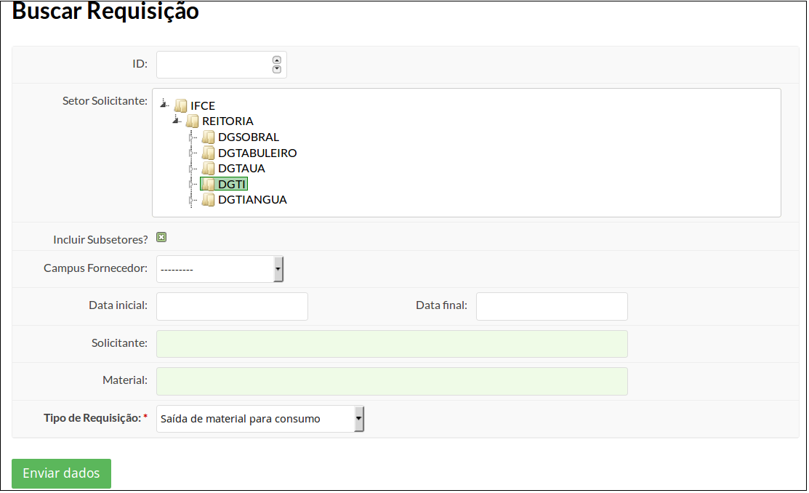
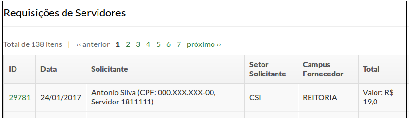

# 5.9. SUAP/Almoxarifado - Requisição de material para consumo

## 5.9.1 Introdução

O fornecimento de material de consumo se dará por requisição, sendo dever do servidor requisitante do material retirá-lo no Setor de Almoxarifado (Fonte: Art 21, Manual de Gestão de Materiais do IFCE).

## 5.9.2 Perfis de acesso

A funcionalidade **Requisição de material para consumo** está disponível para usuários pertencentes aos seguintes perfis de acesso:

  - Requisitante de materiais do almoxarifado
  
## 5.9.3 Pré-requisitos

Para atender positivamente a uma requisição de material, é necessário que o material solicitado esteja em estoque no almoxarifado fornecedor.

OBS: Os servidores não tem permissão de consultarem a quantidade disponível: o pedido deve ser feito de acordo com as necessidades de cada um, e a liberação (total ou parcial) está sujeita a análise da Coordenação de Almoxarifado que fornecerá o material.

## 5.9.4 Procedimento de requisição de material pelo SUAP (servidores com o perfil de requisitante de materiais)

Após o registro da nota fiscal e a entrada dos bens no sistema, os usuários estão aptos a fazer requisições. 

Para isso basta acessar o menu **ADMINISTRAÇÃO**, clicar no menu **Almoxarifado**, clicar a opção **Requisições** e por último clicar em **Saída de Material para Consumo**. (Figura 1)

>**Figure 1:**

Você será redirecionado ao formulário "Requisição de Saída de Material para Consumo", que você utilizará para solicitar o material desejado (Figura 2).

>**Figure 2:**

Preencha os seguintes campos:

| Campo | Descrição |
| :-----| :---------|
| **Almoxarifado requisitante** | O campus da Coordenação de Almoxarifado que irá responder a requisição. Preenchido automaticamente. |
| **Pessoa solicitante** | Servidor que está requisitando o material. Este campo é de autocompletar. Localize o servidor pelo nome. |
| **Material** | Descrição do material. Este campo é de autocompletar. Localize o material pelo nome. |
| **Quantidade** | Quantidade desejada de material. |

Caso seja necessário adicionar mais de um material na mesma requisição, clique no botão **“Adicionar Material”** e informe o material e a quantidade desejada (Figura 3).

>**Figure 3:**

Para finalizar o processo clique no botão **“Efetuar”**.

##  5.9.5 Verificar e Responder Requisições Pendentes (Coordenação de Almoxarifado fornecedora) 

Para verificar se existem requisições pendentes, o servidor da Coordenação de Patrimônio deverá acessar o menu **ADMINISTRAÇÃO** - **Almoxarifado** - **Requisições** - **Ver pendentes**.

>**Figure 4:**

Ao fazer isso o usuário será direcionado para a tela a seguir (Figura 4).

>**Figure 5:**

Para responder à requisição clique na requisição desejada (ícone da lupa) e uma tela se apresentará (Figura 5).

>**Figure 6:**

Para **aceitar uma requisição**:
  * selecione os itens que se deseja aceitar, clicando no campo **Aceitar?**.
  * Informe a quantidade aceita do determinado item, no campo **Qtd. Aceita** (podendo a quantidade ser inferior à solicitada).
  * Após o preenchimento dos dados acima, clique no botão **Responder**.

Para **remover a requisição**:
  * Clique no botão "Remover Requisição" localizada no canto superior direito da tela.

## 5.9.6 Efetuar Requisição de Transferência de Material entre Almoxarifados

A transferência de material de consumo entre almoxarifados pode ser feita clicando no menu **ADMINISTRAÇÃO**. Em seguida clique no menu **Almoxarifado**, clique em **Requisições** e por fim clique na opção **Transferência de Material entre câmpus** (Figura 6).

>**Figure 7:**

Será apresentada a seguinte tela (Figura 7):

>**Figure 8:**

Informe os seguintes campos:

| Campo | Descrição |
| :-----| :---------|
| **Pessoa solicitante** | Servidor que está requisitando o material. Já vem preenchido com o nome do servidor que está logado. |
| **Almoxarifado de Destino** | Para qual campus vai o material requisitado. Já vem preenchido com o campus do servidor que está logado. |
| **Almoxarifado Fornecedor** | Selecione o campus que fornecerá o material. |
| **Material** | Selecione o material que deseja solicitar. Este campo é de autocompletar. Localize o material pelo seu nome. |
| **Quantidade** | A quantidade de material requerida. |

Após preenchidos os campos, clique no botão **"Efetuar"**.

**OBS:** Só é possivel fazer requisição de materiais que possuam estoque no almoxarifado da unidade escolhida.

**OBS2:** apenas o "Coordenador de Almoxarifado" de cada campus deverá possuir o perfil de autorizar saída e entrada de materiais, ficando para os demais Coordenadores/Chefes de Departamento/Diretores apenas o perfil para requisição.

## 5.9.7 Busca de requisição 

Para localizar uma requisição, acesse o menu **ADMINISTRAÇÃO**, clicar no menu **Almoxarifado**, clicar a opção **Requisições** e por último clicar em **Requisições**. (Figura 9)

>**Figure 9:**

O menu redirecionará ao formulário a seguir (Figura 10):

>**Figure 10:**

A busca pode ser feita por meio dos seguintes campos:

| **ID** | número da requisição |
| :-----| :---------| :---------|
| **Incluir Subsetores?** | Deixe marcado |
| **Campus Fornecedor** | - |
| **Data inicial** | - |
| **Data final** | - |
| **Solicitante** | - |
| **Material** | - |
| **Tipo de Requisição** | [Saída de material para consumo] ou [Transferência de Material entre campi] |

Escolha um ou mais critérios que melhor facilitem a busca da requisição do material a ser devolvido e clique em **"Enviar dados"**.

A tela será recarregada e, ao final, será exibida a listagem de requisições (Figura 11).

>**Figure 11:**

Clique no número requisição desejada. 
Será feito o redirecionamento para a tela de detalhamento da requisição.