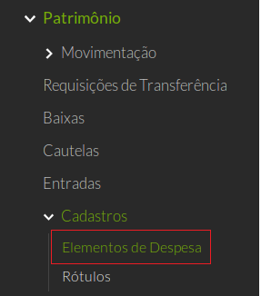
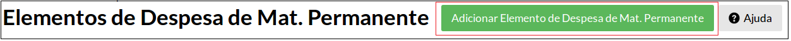
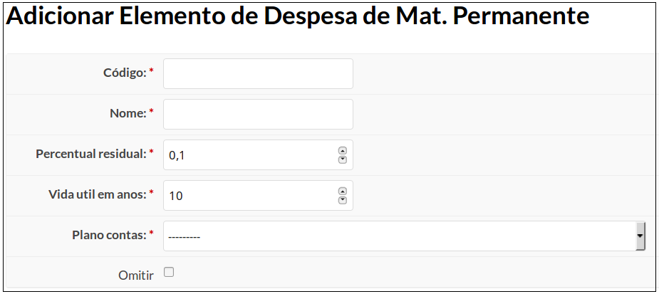

# 3.4. SUAP/Patrimônio - Elementos de despesa de material permanente

## 3.4.1. Perfis

A funcionalidade **Cadastrar/Editar Elementos de despesa de material permanente** está disponível para usuários pertencentes ao seguinte perfil:

  * Contador de patrimônio sistêmico
  * Contador de patrimônio administrador

--------------------------------

## 3.4.2. Conceitos

|                  |                                                       |
| :-----------------| :-----------------------------------------------------|
|Elemento de despesa|Todos os bens cadastrados no SUAP pertencem a uma categoria de produtos (classificação), facilitando a organização, a busca e a utilização geral do sistema. Tem por finalidade identificar os objetos de gasto. (Fonte: MCASP, 6ed)|
|449052 | Refere-se a Equipamentos e Material Permanente. Identifica as despesas orçamentárias com aquisição de aeronaves; aparelhos de medição; aparelhos e equipamentos de comunicação; aparelhos, equipamentos e utensílios médico, odontológico, laboratorial e hospitalar; aparelhos e equipamentos para esporte e diversões; aparelhos e utensílios domésticos; armamentos; coleções e materiais bibliográficos; embarcações, equipamentos de manobra e patrulhamento; equipamentos de proteção, segurança, socorro e sobrevivência; instrumentos musicais e artísticos; máquinas, aparelhos e equipamentos de uso industrial; máquinas, aparelhos e equipamentos gráficos e equipamentos diversos; máquinas, aparelhos e utensílios de escritório; máquinas, ferramentas e utensílios de oficina; máquinas, tratores e equipamentos agrícolas, rodoviários e de movimentação de carga; mobiliário em geral; obras de arte e peças para museu; semoventes; veículos diversos; veículos ferroviários; veículos rodoviários; outros materiais permanentes. (Fonte: MCASP, 6ed) |

-----------------

## 3.4.3. Relação dos elementos de despesa de material permanente do SUAP

| NOME | CÓDIGO | DESCRIÇÃO |
| :-----------------| :-----------------------------------------------------| :-----------------------|
| AERONAVES  | 4490.52.02 | Registra o valor das despesas com qualquer tipo de aeronave de asa fixa  ou asa rotativa, tais como: avião, balão, helicóptero, planador, ultraleve e afins. |
| APARELHOS DE MEDICAO E ORIENTACAO  | 4490.52.04  | Registra o valor das despesas com todos os  aparelhos de medição ou contagem. Quando estes aparelhos forem incorporados a um equipamento maior serão os mesmos considerados componentes, tais como: amperímetro, aparelho de medição meteorológica,  balanças em geral, bússola, calibrador de pneus, cronômetro, hidrômetro, magnetômetro, manômetro,  medidor de gás, mira-falante, níveis topográficos, osciloscópio, paquímetro, pirômetro, planimetro,   psicrômetro, relógio medidor de luz, sonar, sonda, taquímetro, telêmetro, teodolito, turbímetro e afins. |
| APARELHOS E EQUIPAMENTOS DE COMUNICACAO | 4490.52.06 | Registra o valor das despesas com todo material considerado permanente, portátil ou transportável, de uso em comunicações, que não se incorporem em instalações, veículos de qualquer espécie, aeronaves ou embarcações, tais como: antena parabólica, aparelho de telefonia, bloqueador telefônico, central telefônica, detector de chamadas telefônicas, fac-símile, fonógrafo, interfone, PABX, rádio receptor, rádio  telegrafia, rádio telex, rádio transmissor, secretaria eletrônica, tele-speaker e afins|
| APAR.EQUIP.UTENS.MED.,ODONT,LABOR.HOSPIT.  | 4490.52.08  | Registra o valor das despesas com qualquer aparelho, utensílio ou equipamento de uso médico, odontológico, laboratorial e hospitalar que não se integrem a instalações, ou a outros conjuntos monitores. No caso de fazerem parte de instalações ou outros conjuntos, deverão ser considerados componentes, tais como: afastador, alargador, aparelho de esterilização, aparelho de Raio X, aparelho de transfusão de  sangue, aparelho  infravermelho, aparelho para inalação, aparelho de ultravioleta, balança pediátrica, berço  aquecido, biombo, boticão, cadeira de dentista, cadeira de rodas, câmara de infravermelho, câmara de oxigênio, câmara de radioterapia, carro-maca, centrifugador, destilador, eletro-analisador, eletro-ardiográfico, estetoscópio, estufa, maca, medidor de pressão arterial (esfignomanômetro), megatoscópio, mesa para exames clínicos, microscópio, tenda de oxigênio, termocautério e afins. |
| APARELHOS E EQUIP. P/ ESPORTES E DIVERSOES  | 4490.52.10 | Registra o valor das despesas com instrumentos, aparelhos e utensílios destinados a qualquer modalidade de esportes e diversões de  qualquer natureza, desde que não integrados a instalações de ginásios de esportes, centros  esportivos, teatro, cinema, etc, tais como: arco, baliza, barco de regata, barra, bastão, bicicleta  ergométrica, carneiro de madeira, carrossel, cavalo, dardo, deslizador, disco, halteres, martelo,  peso, placar, remo, vara de salto e afins. |
| APARELHOS E UTENSILIOS DOMESTICOS  | 4490.52.12 | Registra o valor das despesas com aquisição de  eletrodomésticos em geral e utensílios, com durabilidade superior a dois anos, utilizados em serviços domésticos, tais como: aparelhos de copa e cozinha, aspirador de pó, batedeira, botijão de gás,  cafeteira elétrica, chuveiro ou ducha elétrica, circulador de ar, condicionador  de  ar  (móvel), conjunto de chá/café/jantar, escada portátil, enceradeira, exaustor, faqueiro, filtro de água, fogão, forno de microondas, geladeira, grill, liquidificador, máquina de lavar louca, máquina de lavar    roupa, máquina de moer café, máquina de secar pratos, secador de prato, tábua de passar roupas,  torneira elétrica, torradeira elétrica, umidificador de ar e afins|
| ARMAMENTOS  | 4490.52.14  | Registra o valor das despesas com armas de porte, portáteis transportáveis autopropulsionadas, de tiro tenso, de tiro curvo, central de tiro, rebocáveis ou motorizadas, rampas lançadoras de foguetes motorizadas e outros apetrechos bélicos, tais como: Fuzil, metralhadora, pistola, revolver e afins. |
| BANDEIRAS, FLAMULAS E INSIGNIAS  | 4490.52.16  | Registra o valor das despesas com aquisição de bandeiras, flâmulas e insígnias, a saber, tais como: brasões, escudos, armas da república, selo nacional e afins.|
| COLECOES E MATERIAIS BIBLIOGRAFICOS | 4490.52.18 |Registra o valor das despesas com coleções bibliográficas de obras científicas, românticas, contos e documentários históricos, mapotecas, dicionários para uso em bibliotecas, enciclopédias, periódicos encadernados para uso em bibliotecas, palestras, tais como: álbum de caráter educativo, coleções e materiais bibliográficos informatizados, dicionários, enciclopédia, ficha bibliográfica, jornal e revista (que constitua documentário), livro, mapa, material folclórico, partitura musical, publicações e documentos especializados destinados a bibliotecas, repertorio legislativo  e afins. |
| DISCOTECAS E FILMOTECAS | 4490.52.19 | Registra o valor das despesas com discos, CD e coleções de fitas gravadas com músicas e fitas cinematográficas de caráter educativo, científico e informativo, tais como: disco educativo, fita de áudio e vídeo com aula de caráter educativo, microfilme  e afins.|
| EMBARCACOES  | 4490.52.20  | Registra o valor das despesas com todas as embarcações fluviais, lacustres ou marítimas exceto os navios graneleiros, petroleiros e transportadores de passageiros que são considerados como bens imóveis, tais como: canoa, casa flutuante, chata, lancha, navio, rebocador, traineira e afins. |
| EQUIPAMENTOS DE MANOBRA E PATRULHAMENTO  | 4490.52.22  | Registra o valor das despesas com todos  os materiais permanentes utilizados em manobras militares e paramilitares, bem assim, aqueles utilizados em qualquer patrulhamento ostensivo, tais como: barraca, bloqueios, cama de campanha, farol de comunicação – mesa de campanha, pára-quedas, pistola  de  sinalização, sirene  de campanha e afins. |
| EQUIPAMENTO DE PROTECAO, SEGURANCA E SOCORRO  | 4490.52.24  | Registra o valor das despesas com  todos os materiais permanentes utilizados na proteção e segurança de pessoas ou bens públicos, como  também qualquer outro utilizado para socorro diverso, ou sobrevivência em qualquer ecossistema, tais como: alarme, algema, arma para vigilante, barraca para uso não militar, bóia salva-vida, cabine  para guarda (guarita), cofre, extintor de incêndio, pára-raio, sinalizador de garagem, porta giratória, circuito interno de televisão e afins. |
| INSTRUMENTOS MUSICAIS E ARTISTICOS  | 4490.52.26  | Registra  o  valor  das  despesas  com  todos  os  instrumentos  de  cordas,  sopro  ou percussão, como também outros instrumentos  utilizados  pelos artistas em geral.  clarinete, guitarra, pistão, saxofone, trombone, xilofone e afins.|
| MAQUINAS E EQUIPAM. DE NATUREZA INDUSTRIAL  | 4490.52.28  | Registra o valor das despesas com  qualquer máquina, aparelho ou equipamento empregado na fabricação de produtos ou no recondicionamento de afins, tais como: balcão frigorífico, betoneira, exaustor industrial, forno e torradeira  industrial, geladeira  industrial, máquina de fabricação de laticínios, máquina de fabricação de tecidos e afins.  |
| EQUIPAMENTOS PARA AUDIO, VIDEO E FOTO  | 4490.52.33  | Registra o valor das despesas com aquisição   de equipamentos de filmagem, gravação e reprodução de sons e imagens, bem como os acessórios de  durabilidade superior a dois anos, tais como: amplificador de som, caixa acústica, data show, eletrola, equalizador de som, filmadora, flash eletrônico, fone de ouvido, gravador de som, máquina  fotográfica, microfilmadora, microfone, objetiva, projetor, rádio, rebobinadora, retro-projetor, sintonizador de som, tanques para revelação de filmes, tape-deck, televisor, tela para projeção, toca-discos, vídeo-cassete e afins. |
| EQUIPAMENTOS DE PROCESSAMENTO DE DADOS  | 4490.52.35  | Registra o valor das despesas com todas as  máquinas, aparelhos e equipamentos utilizados em processamento de dados de qualquer natureza, exceto  quando for aquisição de peças destinadas à reposição diretamente ao equipamento ou mesmo para estoque, tais como: caneta óptica, computador, controladora de linhas, data show – fitas e discos magnéticos,  impressora, kit multimídia, leitora, micro e minicomputadores, mesa digitalizadora, modem, monitor de vídeo, placas, processador, scanner, teclado para micro, urna eletrônica e afins. |
| MAQ., FERRAMENTAS E UTENSILIOS DE OFICINA | 4490.52.38 | Registra o valor das despesas com máquinas, ferramentas e utensílios utilizados em oficinas mecânicas, marcenaria, carpintaria e serralheria, não incluindo ferramentas que não façam parte de um conjunto, nem tão pouco materiais permanentes utilizados em oficinas gráficas, tais como: analisador de motores, arcos de serra, bomba para esgotamento de tambores, compressor de ar, conjunto de oxigênio, conjunto de solda, conjunto para lubrificação, desbastadeira, desempenadeira, elevador hidráulico, esmerilhadeira, extrator de precisão, forja, fundidora para confecção de broca, laminadora, lavadora de carro, lixadeira, macaco mecânico e hidráulico, mandril, marcador de velocidade, martelo mecânico, níveis de aço ou madeira, pistola  metalizadora, polidora, prensa, rebitadora, recipiente de ferro para combustíveis, saca-pino, serra de bancada, serra mecânica, talhas, tanques para água, tarracha, testadora, torno mecânico, vulcanizadora e afins.|
| EQUIP. E UTENSILIOS HIDRAULICOS E ELETRICOS  | 4490.52.39  | Registra o valor das despesas com  equipamentos destinados a instalação conservação e manutenção de sistemas hidráulicos e elétricos, tais como: bomba d’água, bomba de desentupimento, bomba de irrigação, bomba de lubrificação, bomba de sucção e elevação de água e de gasolina carneiro hidráulico, desidratadora, máquina  de tratamento  de água, máquina de tratamento de esgoto, máquina de tratamento de lixo, moinho, roda d’água e afins.|
| MAQUINAS E EQUIPAMENTOS ENERGETICOS  | 4490.52.30  | Registra o valor das despesas com máquinas, aparelhos e equipamentos não incorporáveis a instalações, destinados a geração de energia de qualquer espécie, tais como: alternador energético, carregador de bateria, chave automática, estabilizador, gerador, haste de contato, NO-BREAK, poste de iluminação, retificador, transformador de voltagem, rilho, truck-tunga, turbina (hidrelétrica) e afins. |
| MAQUINAS E EQUIPAMENTOS GRAFICOS  | 4490.52.32  | Registra o valor das despesas com todas as máquinas, aparelhos e equipamentos utilizados em reprografia ou artes gráficas, tais como: aparelho  para encadernação, copiadora, cortadeira elétrica, costuradora de papel, duplicadora, grampeadeira, gravadora de extenso, guilhotina, linotipo, máquina de OFF-Set, operadora de ilhoses, picotadeira, teleimpressora e receptadora de páginas e afins.  |
| MAQUINAS, UTENSILIOS E EQUIPAMENTOS DIVERSOS  | 4490.52.34 | Registra o valor das despesas com máquinas, aparelhos e equipamentos que não estejam classificados em grupo específico, tais como: aparador de grama, aparelho de ar condicionado, bebedouro – carrinho de feira, container, furadeira, maleta executiva, urna eleitoral, ventilador de coluna e de mesa e afins. |
| MAQUINAS, INSTALACOES E UTENS. DE ESCRITORIO  | 4490.52.36  | Registra o valor das despesas com  todas as máquinas, aparelhos e utensílios utilizados em escritório e destinados ao auxílio do trabalho  administrativo, tais como: aparelho rotulador, apontador fixo (de mesa), caixa registradora, carimbo digitador de metal, compasso, estojo para desenho, globo terrestre, grampeador (exceto de mesa), máquina autenticadora, máquina de calcular, máquina de contabilidade, máquina de escrever, máquina franqueadora, normógrafo, pantógrafo, quebra-luz (luminária de mesa), régua de precisão, régua T, relógio protocolador e afins. |
| MAQUINAS E EQUIPAMENTOS AGRIC. E RODOVIARIOS  | 4490.52.40  | Registra o valor das despesas com todas as máquinas, tratores e equipamentos utilizados na agricultura, na construção e conservação de estradas, tais como: arado, carregadora, ceifadeira, compactador, conjunto de irrigação, conjunto  moto-bomba para irrigação, cultivador, desintegrador, escavadeira, forno e estufa de secagem ou   amadurecimento, máquinas de beneficiamento, microtrator – misturador  de  ração, moinho agrícola,    motoniveladora, moto-serra, pasteurizador, picador de forragens, plaina terraceadora,  plantadeira,  pulverizador, de tração animal ou mecânica, rolo compressor, roçadeira,  semeadeira,  silo  para  depósito  de cimento, sulcador, trator de roda e esteira e afins.  |
| MOBILIARIO EM GERAL  |  4490.52.42 | Registra o valor das despesas com móveis destinados ao uso ou decoração interior de ambientes, tais como: abajur, aparelho para apoiar os braços, armário, arquivo de aço ou madeira, balcão (tipo atendimento), banco,  banqueta, base para mastro, cadeira, cama,  carrinho fichário, carteira e banco escolar, charter negro, cinzeiro com pedestal, criado-mudo, cristaleira, escrivaninha, espelho moldurado, estante  de madeira ou aço, estofado, flipsharter, guarda-louça, guarda roupa, mapoteca, mesa, penteadeira, poltrona, porta-chapéus, prancheta para desenho, quadro de chaves, quadro imantado, quadro para editais e avisos, relógio de mesa/parede ponto, roupeiro, sofá, suporte para tv e vídeo, suporte para bandeira (mastro), vitrine e afins. |
| OBRAS DE ARTE E PECAS PARA MUSEU  | 4490.52.44  | registra o valor das despesas com objetos de valor artístico e histórico destinados a decoração ou exposição em geral (em museus, galerias, hall, prédios públicos e outros) - alfaias em louça - documentos e objetos históricos - esculturas - fotos históricas - gravuras - molduras -peças em marfin e cerâmica - pedestais especiais e similares - pinacotecas completas – pinturas em tela - porcelana - tapeçaria - trilhos para exposição de quadros e outros. |
| SEMOVENTES E EQUIPAMENTOS DE MONTARIA  | 4490.52.46  | registra o valor das despesas com animais para trabalho, produção, reprodução ou exposição e equipamentos de montaria. - animais não destinados a laboratório ou corte - animais para jardim zoológico - animais para produção, reprodução e guarda - animais para sela e tração - selas e outros. |
| VEICULOS DIVERSOS  | 4490.52.48  | registra o valor das despesas com veículos não contemplados em subitens específicos. - bicicleta - carrinho de mão - carroca - charrete - empilhadeira e outros. |
| VEICULOS FERROVIARIOS  | 4490.52.50  | registra o valor das despesas com veículos empregados em estradas de ferro. - locomotiva - prancha - reboque - tender - vagão para transporte de carga ou passageiros e outros. |
| PECAS NAO INCORPORAVEIS A IMOVEIS  | 4490.52.51  | registra o valor das despesas com materiais empregados em imóveis e que possam ser removidos ou recuperados. - biombos - carpetes (primeirainstalação) - cortinas - divisorias removiveis - estrados - persianas - tapetes - toldo - grades - mastro para fixação de antena de rádio - bicicletários removíveis. |
| VEICULOS DE TRACAO MECANICA  | 4490.52.52  | registra o valor das despesas com veículos de tração mecânica, tais como: - ambulância- automóvel - basculante - cacamba- caminhão - carro-forte - consultório volante - furgão - lambreta - microonibus - motocicleta - ônibus - rabecão - vassoura mecânica - veículo coletor de lixo - unidade móvel de radiomonitoragem e outros. |
| CARROS DE COMBATE  | 4490.52.53  | registra o valor das despesas com veículos utilizados em manobras militares, tais como: - autochoque - blindado - carro-bomba - carro-tanque e outros. |
| EQUIPAMENTOS, PECAS E ACESSORIOS AERONAUTICOS  |  4490.52.54 | registra o valor das despesas com equipamentos, peças e acessórios aeronáuticos, tais como:- hélice - microcomputador de bordo - turbina e outros. |
| EQUIPAMENTOS, PECAS E ACES.DE PROTECAO AO VOO  |  4490.52.56 | Registra o valor das despesas com equipamentos, peças e acessórios de proteção ao vôo, tais como: radar, rádio e outros. |
| ACESSORIOS PARA AUTOMOVEIS  | 4490.52.57 | registra o valor das despesas com acessórios para veículos que possam ser desincorporados, sem prejuízo dos mesmos, para aplicacao em outro veículo, tais como: ar condicionado - capota - radio/toca-fita - e outros. |
| EQUIPAMENTOS DE MERGULHO E SALVAMENTO  |  4490.52.58 | registra o valor das despesas com equipamentos destinados as atividades de mergulho e salvamento marítimo. - escafandro - jet-ski - tanque de oxigênio e outros. |
| EQUIPAMENTOS E SISTEMA DE PROT.VIG.AMBIENTAL  | 4490.52.83  | registra o valor das despesas com equipamentos e sistema de proteção e vigilância ambiental. |
| EQUIPAMENTOS, PECAS E ACESSORIOS MARITIMOS  | 4490.52.60  | registra o valor das despesas com equipamentos, pecas e acessórios marítimos, tais como: - instrumentos de navegação - instrumentos de medição do tempo - instrumentos óticos – instrumentos geográficos e astronômicos - instrumentos e aparelhos meteorológicos e outros. |
| MATERIAL DE CONSUMO DE USO DURADOURO  | 4490.52.87  | registra o valor das apropriações das despesas com materiais de consumo controlados como de uso duradouro. |
| EQUIP.SOB.DE MAQ.MOTOR.DE NAVIOS DA ESQUADRA  | 4490.52.89  | registra o valor das despesas com componentes de propulsão de navios da esquadra e maquinarias de convés. |
| EQUIP. E MAT. PERMANENTE - PAGTO ANTECIPADO  | 4490.52.96  | registra o valor das despesas decorrentes de pagamentos antecipados para posterior prestação de contas. quando da prestação de contas, o saldo dessa rubrica deverá ser transferido para os subitens específicos, dentro do mesmo grupo. |
| OUTROS MATERIAIS PERMANENTES  | 4490.52.99  | registra o valor das despesas com materiais e equipamentos não contemplados em subitens específicos. |

FONTE: Portaria STN nº 448, de 13 de Setembro de 2002 e SIAFI 2015

--------------------

## 3.4.4. Necessário para 

A funcionalidade **Adicionar Elemento de Despesa permanente** é pré-requisito para que as seguintes funcionalidades sejam executadas:

  * Cadastro dos itens do empenho

--------------

## 3.4.5. Procedimento de cadastro de elemento de despesa 

Após o cadastro do processo, clique no menu **“Administração”**, **“Patrimônio”**, **"Cadastros"** e depois na opção **“Elementos de despesa”** (Figura 1).

>**Figure 1:** Acesso à opção “Elementos de despesa”

Na tela que segue, clique no botão **"Adicionar Elemento de Despesa de Mat. Permanente"**, localizado no canto superior direito da tela (Figura 2).

>**Figure 2:** “Adicionar Elemento de Despesa de Mat. Permanente”

Será exibido o seguinte formulário (Figura 3):

>**Figure 3:** Botão “Adicionar Elemento de Despesa de Mat. Permanente”

Nessa tela deverão ser preenchidos os seguintes campos:

| Campo | Descrição | Obrigatório |
| :-----| :------------| :-------------------|
| Código | informe o código do elemento de despesa. Atenção para não cadastrar códigos iguais para elementos de despesas diferentes. | SIM |
| Nome | informe o nome da categoria de material permanente. | SIM |
| Percentual residual | informa o percentual residual do material (valor do material calculado em forma de porcentagem sobre o valor atual do material, decorrido sua vida útil) | SIM |
| Vida util em anos | o período durante o qual se espera que o ativo seja usado pela empresa; ou o número de unidades produzidas ou unidades semelhantes que se espera sejam obtidas em decorrência da utilização do ativo pela empresa.  | SIM |
| Plano contas | -  | SIM |

Concluído o preenchimento dos campos, escolha um dos três botões abaixo: 

|                   |                         |
| :-----------------| :-----------------------|
|Salvar|Salva o elemento de despesa de mat. permanente no sistema e retorna para a página anterior.|
|Salvar e Adicionar Outro(a)|Salva o elemento de despesa de mat. permanente no sistema e limpa o formulário para que mais um elemento de despesa de mat. permanente possa ser cadastrado.|
|Salvar e Continuar Editando|Salva o elemento de despesa de mat. permanente no sistema e continua na mesma página para que uma nova alteração seja realizada, se necessário.|

--------------------

## 3.4.6. Observações

**OBS 1:** Não é necessário cadastrar ou editar os elementos de despesa de materiais permanentes do SUAP, pois todos já se encontram cadastrados e validados. 

**OBS 2:** As  categorias foram extraídas do SIAFI, neste  sentido  não  é recomendável inserir novas categorias. 

**OBS 3:** Qualquer edição deve ser feito com cautela, pois afeta todos os empenhos cadastrados e as depreciações dos bens.

**OBS 4:** Antes de adicionar uma nova categoria verifique se a categoria já existe.

**OBS 5:** A despesa com confecção de material por encomenda só deverá ser classificada como "serviços de 
terceiros" (339036 - Outros Serviços de Terceiros Pessoa Física; ou 339039 - Outros Serviços de  Terceiros Pessoa Jurídica) se o próprio órgão ou entidade fornecer a matéria-prima. 
 
Caso contrário, deverá ser  classificada:

  * na natureza 449052, em se tratando de confecção de material permanente, ou 
  * na natureza 339030, se material de consumo. 
  
(Art. 6º, PORTARIA Nº 448, DE 13 DE SETEMBRO DE 2002)

---------------