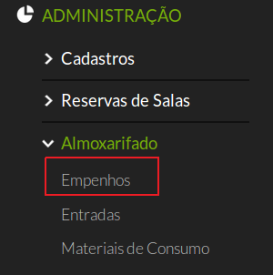
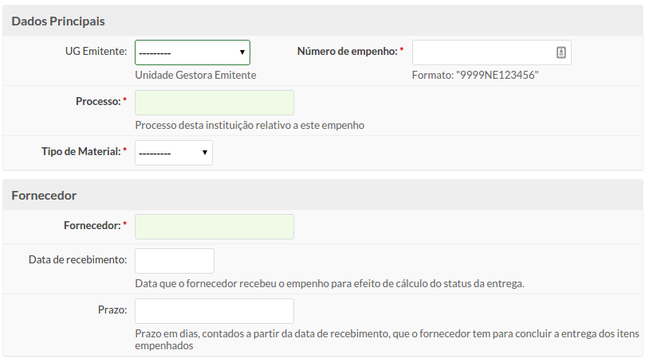
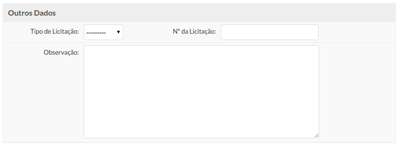
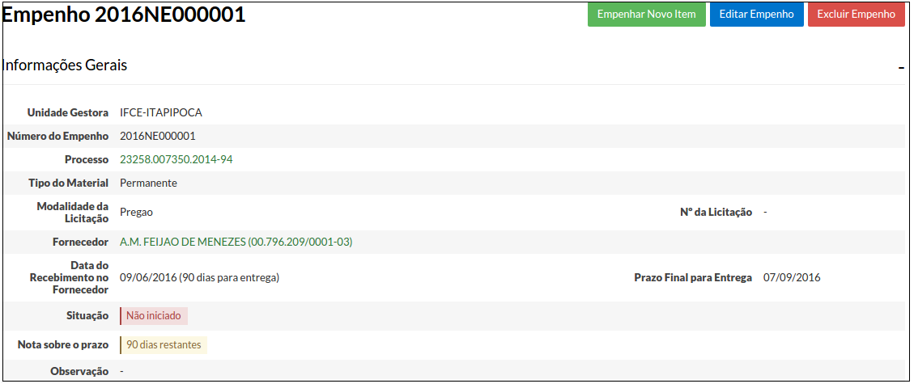

# 4.1. SUAP/Patrimônio - Cadastrar Empenho

## 4.1.1. Conceitos

Termo|Definição|
| :-----| :----|
| Empenho | Ato emanado de autoridade competente, que cria para o estado a obrigação de pagamento pendente ou não de implemento de condição; (Fonte: Lei nº 4.320/64). É a garantia de que existe o crédito necessário para a liquidação de um compromisso assumido; É o primeiro estágio da despesa pública.|
| Nota de empenho | Documento que formaliza o processo de empenho, do qual deve constar o nome do credor, a especificação do credor e a importância da despesa, bem como os demais dados necessários ao controle da execução orçamentária.(Fonte: Lei nº 4.320/64)|
| Material | Designação genérica de equipamentos, componentes, sobressalentes, acessórios, veículos em geral, matérias-primas e outros itens empregados ou passíveis de emprego nas atividades das organizações públicas federais, independente de qualquer fator, bem como, aquele oriundo de demolição ou desmontagem, aparas, acondicionamentos, embalagens e resíduos economicamente aproveitáveis (Fonte: Instrução Normativa nº 205/88 - SEDAP) Para fins de classificação da despesa orçamentária, os materiais são classificados como Material de consumo e Material permanente.|
| Material de Consumo  |aquele que, em razão de seu uso corrente e da definição da Lei nº 4.320/64, perde normalmente sua identidade física e/ou tem sua utilização limitada a dois anos (Fonte: Portaria STN nº 448/02). Exemplos de material de consumo: material de expediente (canetas, papel, borracha); material alimentício (café, açúcar, biscoito) e material de processamento de dados ( toners, cartuchos, conectores, cabos) dentre outros.|
| Material Permanente | aquele que, em razão de seu uso corrente, não perde a sua identidade física, e/ou tem uma durabilidade superior a dois anos (Fonte: Portaria STN nº 448/02). designação genérica de equipamentos, componentes, sobressalentes, acessórios, veículos em geral, matérias primas e outros itens empregados ou passíveis de emprego nas atividades das organizações públicas federais, independente de qualquer fator, bem como aquele oriundo de demolição ou desmontagem, aparas, acondicionamentos, embalagens e resíduos economicamente aproveitáveis. (Fonte: Instrução Normativa nº 205/88 - SEDAP) O Art. 3° da Portaria n° 448, de 13/09/2002, da Secretaria do Tesouro Nacional do Ministério da Fazenda, define a adoção de cinco condições excludentes para a identificação do material permanente.  Esses materiais recebem tombamento e são distribuídos mediante assinatura do termo de responsabilidade pelo servidor recebedor.  Exemplos de material permanente: móveis (mesa, cadeira), equipamento de tecnologia da informação (computadores, switches), equipamentos de uso domésticos (ares condicionados, bebedouros). |
| Licitação | destina-se a garantir a observância do princípio constitucional da isonomia, a seleção da proposta mais vantajosa para a administração e a promoção do desenvolvimento nacional sustentável e será processada e julgada em estrita conformidade com os princípios básicos da legalidade, da impessoalidade, da moralidade, da igualdade, da publicidade, da probidade administrativa, da vinculação ao instrumento convocatório, do julgamento objetivo e dos que lhes são correlatos. (Fonte: Lei nº 8.666/93) |

-----------------------------

## 4.1.2. Perfis de acesso

A funcionalidade **Adicionar empenho** está disponível para usuários pertencentes aos seguintes perfis de acesso:

  - Coordenador de almoxarifado do campus
  - Coordenador de almoxarifado sistêmico
  - Operador de almoxarifado do campus

## 4.1.3. Necessário para

A funcionalidade **Adicionar empenho** é pré-requisito para que as seguintes funcionalidades sejam executadas:

  * Cadastro dos itens do empenho
  * Registro da entrada de Bens patrimoniais
  * Registro e transferência de Carga patrimonial

-----------------------------

## 4.1.4. Pré-requisitos

É necessário que, antes de cadastrar o empenho, seja atendidos os seguintes pré-requisitos:
  * Cadastro do processo relativo através do módulo de Protocolo. Portanto este módulo deve estar em funcionamento para que a utilização do módulo de Patrimônio tenha prosseguimento. [Clique aqui para maiores informações sobre como cadastrar processos](/guides/suap/models/protocolo_manual_do_usuario_cadastro_do_processo.html)
  * Ter em mãos uma cópia da Nota de Empenho a ser cadastrada.

## 4.1.5. Procedimento de cadastro de empenho

Após o cadastro do processo, clique no menu **“Administração”**, **“Almoxarifado”** e depois na opção **“Empenhos”** (Figura 1).

>**Figure 1:** Acesso à opção “Empenhos”

Será exibida uma tela de listagem de empenhos (Figura 2), onde poderão ser consultados todos os empenhos cadastrados no sistema.

>**Figure 2:** Acesso à opção “Empenhos”

Para adicionar um novo empenho clique no botão “Adicionar Empenho” localizado no canto superior direito da página (Figura 3).

>**Figure 3:** Acesso à opção “Empenhos”

Será exibida uma tela com os campos a seguir (Figura 4).

>**Figure 4:** Adicionar Empenho

Nessa tela deverão ser preenchidos os seguintes campos:

| Campo | Descrição | Obrigatório |
| :-----| :---------| :-----------|
| UG Emitente | Corresponde a Unidade Gestora Emitente (ex: IFCE-REITORIA, IFCE-FORTALEZA, IFCE-SOBRAL). | SIM |
| Número do Empenho  | O número que consta na nota de empenho. Preencher com os quatros algarismos do ano, seguido de NE e o número de seis dígitos (formato: AAAANEXXXXXX). Ex: 2016NE050000 | SIM |
| Processo  | Processo da instituição, aberto no módulo Protocolo. Caso  não  tenha permissão para cadastrar o processo, solicite ao responsável pelo protocolo para gerar o número.  Ao digitar os primeiros números do processo, o sistema disponibilizará as opções existentes, devendo o usuário selecionar aquele desejado. | SIM |
| Tipo de material | Deverá ser informado se o material é de consumo ou permanente. | SIM |
| Fornecedor | Nome do fornecedor referente ao empenho. Ao digitar as primeiras letras do nome do fornecedor, o sistema disponibilizará as opções existentes, devendo o usuário selecionar aquele desejado.| SIM |
| Data de recebimento | Data que o fornecedor recebeu o empenho para efeito de cálculo do status da entrega. | NÃO |
| Prazo | Prazo em dias,contados a partir da data de recebimento, que o fornecedor tem para efetuar a entrega dos itens empenhados. | NÃO |
| Tipo de Licitação | Dispensa, Pregão, Srp (Sistema de Registro de Processos), Inex (Inexibilidade de Licitação). | NÃO |
| N° da Licitação | Especifique o número da licitação. | NÃO |
| Observação | Observações pertinentes à licitação. | NÃO |

Concluído o preenchimento dos campos, escolha um dos três botões abaixo:

|       |           |             |
| :-----| :---------| :-----------|
|**Salvar:**|Salva o empenho no sistema e retorna para a página anterior.|
|**Salvar e adicionar outro(a):**|Salva o empenho no sistema e limpa o formulário para que mais um empenho possa ser cadastrada.|
|**Salvar e continuar editando:**|Salva o empenho no sistema e continua na mesma página para que uma nova alteração seja realizada, se necessário.|

Após efetuado o cadastro você será redirecionado para a página a seguir (Figura 5):

>**Figure 5:** Finalização do cadastro do empenho

No topo serão exibidos três botões:

|       |           |
| :-----| :---------|
|Empenhar novo item | Usado para adicionar os bens de consumo ou permanentes que fazem parte do empenho. Uma vez que o empenho foi cadastrado é necessário lançar os itens de empenho, cuja operação é apresentada a seguir.|
|Editar Empenho| Usado para alterar algum dado do empenho|
|Excluir empenho | Usado para remover o empenho |
