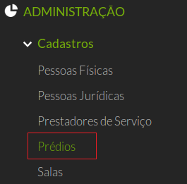
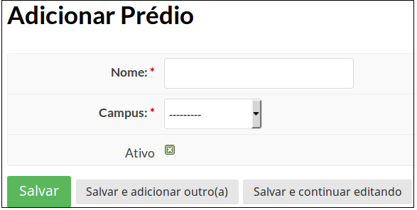

# 4.1. SUAP/Patrimônio - Cadastrar prédios e salas

## 4.1.1. Procedimento para cadastro de prédios

Para cadastrar um fornecedor, clique no menu Administração → Cadastros → Prédios (Figura 1). 

>**Figure 1:** Menu de cadastro de Prédios 

Em seguida, no canto superior direito, clique no botão **“Adicionar Prédio”** (Figura 2). 

>**Figure 2:** Botão cadastrar prédio 

O formulário para cadastro de prédio será exibido em seguida (Figura 3).

>**Figure 3:** Formulário de cadastro de prédios 
