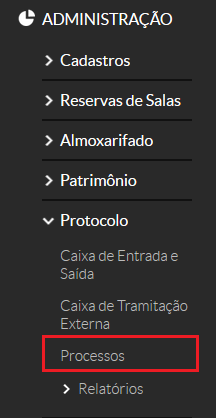
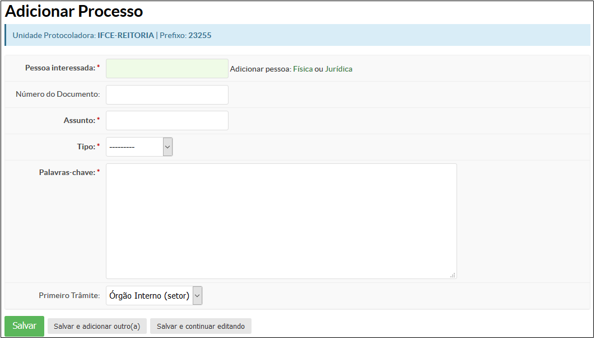

# 4.2. SUAP/Patrimônio - Cadastrar processo

## 4.2.1. Perfis

A funcionalidade **Adicionar Processo** está disponível para usuários pertencentes ao seguinte perfil:

  * Cadastrador de processos
  
## 4.2.2 Necessário para

A funcionalidade **Adicionar empenho** é pré-requisito para que as seguintes funcionalidades sejam executadas:

  * Cadastro de empenho

## 4.2.3. Cadastros Prévios

Os seguintes cadastros são recomendados para que a funcionalidade **Adicionar Processo** possa ser executada:

  * Servidor (Pessoa interessada)
  * Lotação atualizada do servidor
  * Setor de destino do documento
  
## 4.2.4. Detalhamento da funcionalidade de cadastrar um processo

Para cadastrar um processo no SUAP, clique no menu **Administração** → **Protocolo** → **Processos** (Figura 1).

Em seguida, no canto superior direito da tela, clique no botão **“Adicionar  Processo"** (Figura 2). 

O formulário de cadastro de processos será exibida em seguida.

A seguir estão descritos os campos do cadastro de processo. 

|Campo|Descrição|Obrigatório|
| :----| :------| :---------|
|Pessoa Interessada|Nome do servidor que protocola o processo de compra|SIM|
|Número do documento|Informe o número do documento (por exemplo, o número do memorando)|NÃO|
|Assunto|Descreva o assunto do documento|SIM|
|Tipo|Escolha entre as opções: memorando, ofício, requerimento|SIM|
|Palavras-chave|Informe algumas palavras-chave, separadas por vírgula, para uma rápida localização do documento|SIM|

Concluído o preenchimento dos campos, escolha um dos três botões abaixo: 

|Botão|Descrição|
| :----| :------|
|Salvar|Salva o processo no sistema e retorna para a página anterior.|
|Salvar e Adicionar Outro(a)|Salva o processo no sistema e limpa o formulário para que mais um processo possa ser cadastrada.|
|Salvar e Continuar Editando |Salva o processo no sistema e continua na mesma página para que uma nova alteração seja realizada, se necessário.|
