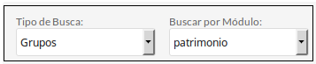
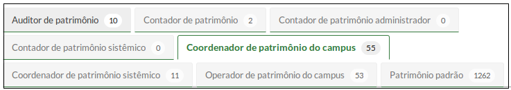
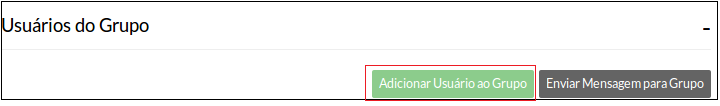

# 3.4 SUAP/Patrimônio - Perfis de acesso

## 1 - Descrição dos perfis

| Perfil | Atividades realizadas | Destinado a |
| :------| :---------------------| :-----------|
|Patrimonio Administrador|Conceder perfis de acesso aos usuários para acesso ao módulo de Patrimônio|Coordenador de Patrimônio de cada campus|
|Contador de patrimônio|Alterar elemento de despesa de material permanente; buscar e visualizar inventários; alterar requisição; visualizar requisições do campus; cadastrar número PA em uma transferência de carga patrimonial;| Contador de cada campus |
|Contador de patrimônio sistêmico|Alterar e editar elemento de despesa de material permanente; Adicionar, excluir e editar Plano de Contas; Alterar requisição; Visualizar requisições do próprio campus; cadastrar número PA em uma transferência de carga patrimonial;|Contador da Reitoria|
|Coordenador de patrimônio do campus|Visualizar empenho de bens permanentes; Buscar e visualizar entradas; Adicionar e editar prédios; Adicionar e editar salas; Adicionar, excluir e alterar baixas patrimoniais; Adicionar e editar fornecedores; Requisitar Transferência dentro do próprio campus; Visualizar requisições do campus; Adicionar e editar baixas patrimoniais; Adicionar e editar cautelas; Adicionar e editar rótulos; Buscar e visualizar inventários; Visualizar relatórios; Alterar carga contábil; Adicionar, excluir e alterar conferência de sala |Coordenador de Patrimônio de cada campus |
|Coordenador de patrimônio sistêmico|Visualizar empenho de bens permanentes; Buscar e visualizar entradas; Adicionar e editar prédios; Adicionar e editar salas; Adicionar, excluir e alterar baixas patrimoniais; Adicionar e editar cautelas; Adicionar e editar fornecedores; Requisitar Transferência dentro do próprio campus; Visualizar requisições do campus; Adicionar e editar baixas patrimoniais; Adicionar e editar rótulos; Buscar e visualizar inventários dos campi; Visualizar os relatórios dos campi; Alterar carga contábil; Adicionar, excluir e alterar conferência de sala;  |Coordenação de Patrimônio da Reitoria|
|Operador de patrimônio do campus|Visualizar empenho de bens permanentes; Buscar e visualizar entradas; Adicionar e editar prédios; Adicionar e editar salas; Adicionar e alterar baixas patrimoniais; Adicionar e editar cautela; Editar inventário do campus; Ver os relatórios; Visualizar inventários do campus; Adicionar e editar rótulos; Visualizar requisições do campus; Adicionar e editar fornecedores|Servidores lotados na Coordenação de Patrimônio de cada campus (desde que não sejam coordenadores)|
|Auditor de patrimônio|Pode ver os relatórios dos campi|Auditores|

-----------------------

## 2 - Atribuindo os perfis do módulo de Patrimônio a um usuário

### 2.1 - Na tela inicial, clique na opção **"Grupos e Usuários"**, localizado no lado direito da tela (Figura 1)

>**Figure 1:** Menu “Grupos e Usuários”

### 2.2 - Na tela **"Gerenciar Grupos e Usuários"**, selecione o módulo **"patrimônio"** (Figura 2).

>**Figure 2:** Selecionar módulo “Patrimônio”

### 2.3 - Clique na aba contendo o perfil desejado (por exemplo, **Coordenador de Patrimônio do Campus**) (FIgura 3)

>**Figure 3:** Perfis do módulo Patrimônio
    
### 2.4 - Clicar no botão **"Adicionar usuário ao grupo"** (Figura 4)

>**Figure 4:** Botão “Adicionar usuário ao grupo”

### 2.5 - Procure o usuário pelo nome ou pela matrícula SIAPE (Figura 5)

>**Figure 5:** Localizar usuário
    
### 2.6 - Selecione o usuário clicando nos seus dados e confirme (Figura 6)

**OBS:** Não atribuir ao mesmo usuário os perfis de Operador de Patrimônio e Coordenador de Patrimônio, pois o perfil de Operador "sobrescreve" o de Coordenador.

------------------