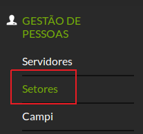
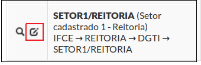
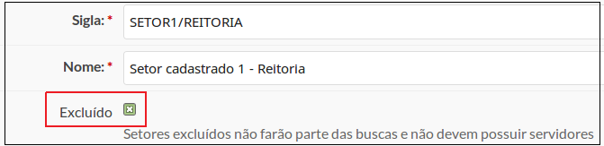

# SUAP/Gestão de Pessoas/Manual do usuário/Desativar setor

No SUAP não se exclui setor: apenas os inativa.

Esta medida é utilizada para preservar a integridade dos dados do sistema, pois vários módulos possui dados cujos setores estão vinculados.

Clique no menu **“Gestão de Pessoas”** → **“Setores”** (Figura 10).

>**Figure 1:** Menu Setores

Localize o setor a ser desativado e clique no ícone do lápis (Figura 11).

>**Figure 2:** Editando Setor para inativação

Marcar a opção **“Excluído”** (Figura 12) e clicar no botão **Salvar**.

>**Figure 3:** Opção Excluído

Será exibida a mensagem **“Atualização realizada com sucesso”**. 