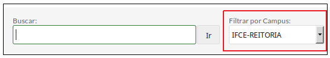
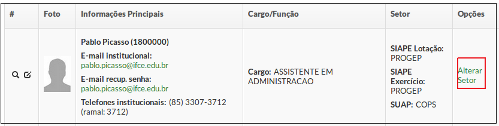
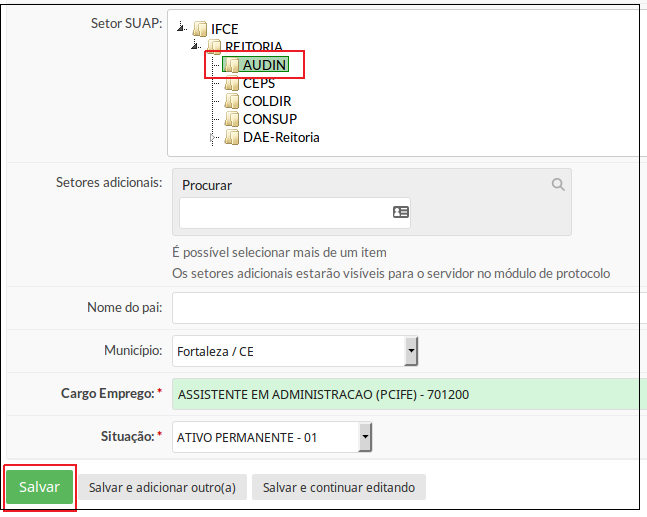

# Lotar Servidores (orientação à Reitoria)

## a) Observações

**OBS 1:** Para saber quem tem o perfil para alterar lotação na Reitoria, [clique aqui](/guides/suap/models/suap_rh_manual_quem_alteram_lotacao_reitoria.html).

**OBS 2:** A Reitoria pode alterar a lotação de todos os servidores do IFCE.

**OBS 3:** Para que um servidor possa alterar a lotação dos servidores de seu campus, é necessário atribui-lo o perfil Coordenador de RH Sistêmico.

## b) Passo-a-passo

A listagem de servidores é exibida ao clicar no menu **“Gestão de Pessoas”** → **“Servidores”** (Figura 1).

>**Figure 1:** Menu Servidores

Na caixa **Filtrar por Campus**, selecionar o campus desejado (Figura 2):

>**Figure 2:** Seleção do campus

Localize o servidor a ser lotado (percorrendo a lista ou localizando-o através do campo Buscar) clique na opção Alterar Setor, localizado do lado direito dos dados do servidor (Figura 3).

>**Figure 3:** Alterar setor

Selecione o setor e clique em **Salvar** (Figura 4).

>**Figure 4:** Escolha do novo setor de lotação