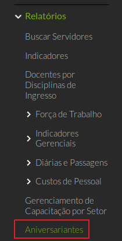
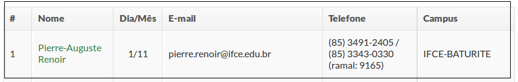
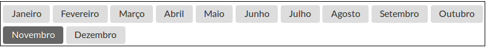

Está disponível no menu lateral em “Gestão de Pessoas” → “Relatórios” → “Aniversariantes”.

 
Na listagem de servidores, serão informados os dados:
* Dia/Mês
* E-mail
* Telefone
* Campus

No topo do relatório haverá a lista de todos os meses em que encontramos servidores aniversariando, sendo sempre iniciado com foco no mês corrente

