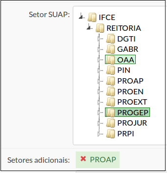

# SUAP/Gestão de Pessoas/Manual do usuário/Setores adicionais

São aqueles que estarão visíveis para o servidor no módulo Protocolo.

Exemplo: Servidor da PROGEP pode tramitar processos do seu setor, e do setor PROAP (Figura 1).

Para cadastrar setores adicionais, basta digitar a Sigla do setor e o sistema listará os setores que atendem ao digitado. Em seguida clicar na sigla desejada.

