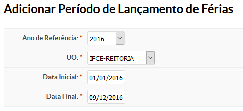
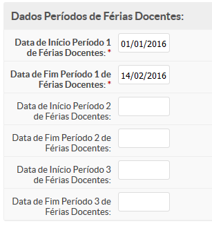
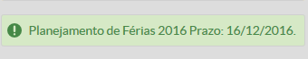
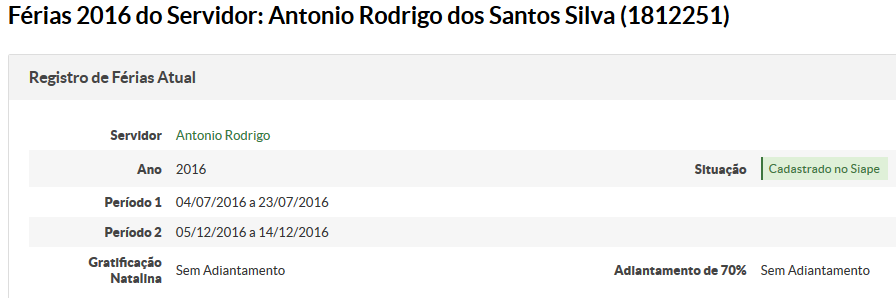
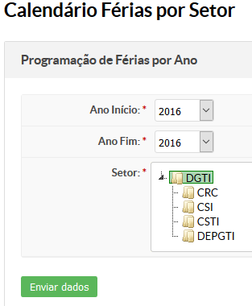
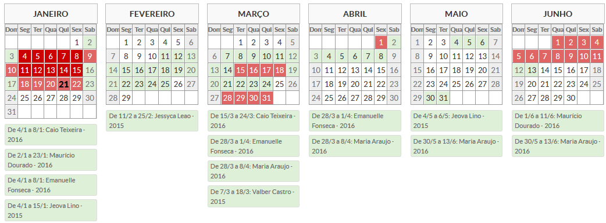

# SUAP/Gestão de Pessoas/Manual do usuário/Solicitação de férias pelo servidor

## a) Visão geral

Os servidores poderão solicitar seu período de férias através do sistema.

Este processo só ocorrerá no período definido pelos gerentes sistêmicos de RH, delimitados por campus.
## b) Cadastrar período de lançamento de férias

OBS: Esta opção está disponível apenas para os usuários que possuem o perfil de Gerente Sistêmico de RH.

Clique no menu Gestão de Pessoas > Férias > Período de Lançamento de Férias.

Para cadastrar, clique no botão “Adicionar Período de Lançamento de Férias”.

A seguinte tela será exibida

O período de lançamento das férias dos docentes é de 45 dias (docentes)

## c) Inclusão e edição de Férias (informações gerais)

Quando o servidor estiver em seu período de lançamento de férias, aparecerá notificação na tela inicial do SUAP, e uma mensagem em AZUL informando o período de lançamento de férias em aberto.

Após o servidor incluir a data de suas férias, esta mensagem ficará na cor VERDE.

Quando clicar na mensagem de incluir férias em AZUL ou VERDE, será aberta uma tela para inclusão/edição de férias.

Em caso de inclusão, basta clicar no botão verde intitulado “Incluir”;

No caso de edição, basta clicar no botão azul intitulado “Editar”.

Ambos os botões estão localizados no canto superior direito da tela.

## d) Solicitar Férias (técnico administrativo)

Na tela que for aberta, haverá as informações referentes às férias para o servidor inclua ou altere:
* Períodos de férias (Até 3 parcelas);
* Observações (Informar quanto ao período de férias pretendido justificando à chefia sobre a necessidade do período / Opcional);
* Opção de Adiantamento de gratificação natalina
* Opção de Adiantamento de 70% do salário (respeitando as regras vigentes).

Após o preenchimento clique no botão Salvar para registrar o planejamento de férias

## e) Solicitar Férias (docente)

Na tela que for aberta, haverá as informações referentes ao período de férias do servidor docente já definidas pelo campus de acordo com o calendário acadêmico sem possibilidade de alteração. O servidor deverá preencher: – Observações (Informações para a chefia caso julgue necessário - Opcional) – Opção de Adiantamento de gratificação natalina. – Opção de Adiantamento de 70% do salário (respeitando as regras vigentes) Após o preenchimento clique no botão Salvar para registrar o planejamento de férias.

## f) Consultar Férias já solicitadas pelo servidor

Na página inicial do SUAP, clique no botão:

Na tela que for aberta, haverá as informações referentes às férias.

## h) Calendário de férias do setor

Clique no menu Gestão de Pessoas > Férias > Calendário de Férias do Setor. Selecione o intervalo desejado e o setor.

Por fim clique em Enviar Dados.

