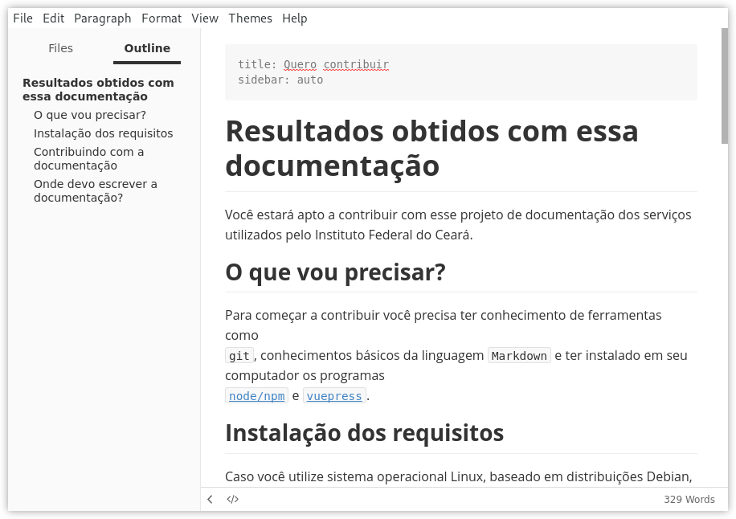

# Apuração e Registro da Frequência do Servidor

O que você precisa saber sobre contagem de tempo? Vamos direto ao ponto!


## 1. Fonte de Informação

### 1.1. Livro de Ponto:  
+ É a fonte original de apuração de frequência do servidor, para pagamento e obtenção de direitos e vantagens;
+ Não pode conter omissões, rasuras, anotações a lápis, registros imprecisos;
+ Deverá ser visado e assinado, diariamente, por servidor da unidade de exercício responsável pelo controle da frequência, assegurando-se a exatidão dos dados e informações;
+ Deverá ser conferido mensalmente, à vista das situações ocorridas, complementando com as informações pendentes;
+ Havendo omissão de dados (falta de assinatura no dia ou de registro de presença, falta ou justificativa), deverão ser consultadas outras fontes comprobatórias;

::: danger Atenção
Caso haja omissão de dados no livro de ponto, cabe ao diretor atual da escola regularizar os registros de ponto, fazendo constar a informação que deverá prevalecer, a fonte de onde foi extraída, a data em que se fez a regularização, 
que será assinada, conjuntamente, por ele e pelo Analista Educacional na função de inspeção escolar.
:::  

### 1.2. Registro de Pagamento
+ Em caso de omissão de dados do Livro de Ponto, o registro de pagamento, deve ser usado para confirmação da frequência;


::: tip Importante
O registro do Livro ou Folha de Ponto prevalece sobre quaisquer registros em outras fontes que dele divergirem. 
:::  


EXEMPLO:


**O que fazer quando for constatado em Livro de Ponto a existência de espaço em branco onde deveria constar a assinatura do
servidor ou algum registro sobre o que ocorreu (“faltoso”, “compareceu e deixou de assinar”, etc.)?**
> Diretor deve consultar os registros de pagamento. Caso seja verificado que o servidor não teve a falta,
deverá ser registrado no Livro de Ponto, no espaço em branco, ou no rodapé da página, ou onde melhor
couber: “considerada a presença, conforme Listagem de Frequência”. Datar e assinar a regularização feita,
juntamente com o Analista Educacional na função de inspeção escolar.
Havendo rasura, deve-se verificar a exatidão do dado por meio de documentação de pagamento, validando-o
ou corrigindo-o, com observação sobre tal procedimento.
Não sendo localizado o Livro de Ponto ou nele não constando qualquer assinatura do servidor ou registro sobre
sua frequência e não havendo nenhuma outra prova do exercício, não caberá proceder-se à “regularização”
do Livro de Ponto, ainda que tenha havido pagamento; neste caso, deverá ser feita sindicância administrativa
para que seja verificada a legalidade dos registros que geraram o pagamento que, se indevidos, não poderão
ser considerados fonte fidedigna para emissão da Certidão de Contagem de Tempo de Serviço.


## 2 - Frequência do Especialista em Educação Básica
+ Tem sua frequência apurada em dias;
+ Para apuração de faltas deverá observar na Tabela de Conversão, tomando-se
por referência o cargo de 18 horas/aula, as quais correspondem a 24 horas semanais, cumpridas na escola,
sendo 4h e 48min, a carga horária diária de trabalho;
+ Ao Especialista sujeito ao regime de 40 horas, aplica-se o disposto na Resolução SEPLAG no 10, de
01/03/2004, que disciplina a apuração de frequência. Assim, o Especialista perderá o dia todo se faltar no 1o
turno, por constituir atraso superior a 55min, limite máximo previsto em lei; a falta no 2o turno caracteriza
saída antecipada, gerando desconto proporcional, portanto, a perda será financeira.

Badge <Badge text="beta" type="warn"/> <Badge text="0.10.1+"/>

* [Quero contribuir](/rotas/formulario/#movimentacao-de-pessoal)

## 3 - Frequência do Professor de Educação Básica
### A - Até 31/01/2013
Nos termos dos artigos 35 e 36 da Lei no 15.293, de 2004, com redação dada pelo artigo 13 da Lei no
15.788, de 27/10/2005, a carga horária do Professor de Educação Básica que ultrapasse a básica, por
exigência curricular ou extensão, não constitui base de cálculo para descontos previdenciários; portanto,
não gera contagem de tempo de serviço/contribuição para nenhuma finalidade. Desta forma, as faltas
assim ocorridas serão informadas apenas para efeito de pagamento, não podendo ser computadas para
efeito de contagem de tempo.
#### 3.1 - Regente de Turma
O regente de turma tem também sua frequência na escola apurada em dias, da mesma forma que
o Especialista em Educação Básica com 24 horas semanais, considerando-se de 4 horas o dia de
trabalho em sala de aula. As horas correspondentes aos dias de faltas são somadas às horas de
falta às reuniões ocorridas. O total de horas de faltas é transformado em dias, conforme a mesma
Tabela de Conversão, tendo como referência o cargo de 18 aulas semanais. Igual tratamento é dado
ao professor na função de substituição eventual e ao orientador de aprendizagem na educação de
jovens e adultos.


#### 3.2 - Professores no Ensino do Uso da Biblioteca, em Ajustamento Funcional, e o Excedente
AJUSTAMENTO FUNCIONAL, E O EXCEDENTE
O Professor no Ensino do Uso da Biblioteca, o excedente na totalidade da carga horária e o Professor em
Ajustamento Funcional têm a frequência verificada na Tabela de Conversão, tomando-se por referência o
cargo de 18 aulas, as quais correspondem a 24 horas semanais, cumpridas integralmente na escola, com
4h e 48min a carga horária diária de trabalho. Sendo a carga horária do cargo inferior a 18 aulas semanais,
a carga horária diária será cumprida proporcionalmente.
Ocorrendo faltas, essas deverão ser informadas para efeito de pagamento e de contagem de tempo,
conforme orientado no item 3.3.
#### 3.3 - Professor Regente de Aulas
Apura-se a frequência do regente de aulas levando-se em consideração o número total de aulas assumidas
pelo cargo, incluídas as assumidas além das obrigatórias pelo regime básico, para efeito de pagamento.
As faltas devem ser deduzidas primeiramente do número de aulas assumidas por exigência curricular ou
por extensão da carga horária. Só deverão ser informadas faltas na carga horária básica do cargo se estas
ultrapassarem a carga horária por extensão ou exigência curricular. Todas as faltas informadas serão
descontadas em folha de pagamento.


Para emissão da contagem de tempo de serviço/contribuição, entretanto, serão computadas apenas as faltas
às aulas do regime básico (aulas obrigatórias do cargo), que é a base de cálculo da contribuição previdenciária.
As horas/aulas de faltas serão convertidas em dias, conforme Tabela de Conversão de Aulas em Dias de
Exercício (ANEXO V), na coluna correspondente ao número de aulas do regime básico do cargo.
#### 3.4 – Professor ou Especialista na função de Vice-Direção de Escola
O ocupante de função ou cargo das carreiras de Professor de Educação Básica e Especialista em Educação
Básica na função de Vice-diretor cumpre 30 horas semanais, devendo sua frequência ser apurada em dias.
O Especialista em Educação Básica sujeito ao cumprimento de quarenta horas semanais, cumprirá trinta
horas semanais quando no exercício da função de Vice-diretor, complementando a carga horária no
desempenho da sua especialidade.


#### 3.5 - Frequência do Professor “APOSTILADO”
O professor que obteve Título Declaratório do direito à continuidade de percepção da remuneração integral
de cargo em comissão deve cumprir a carga horária do cargo em que se apostilou, segundo os critérios a
seguir:
Professor na regência de aulas: conforme a “Tabela de Conversão de Aulas em Dias de Exercício”, o
servidor nesta situação ministra 29 aulas semanais, às quais correspondem 11h de módulo 2, totalizando
as 40 horas semanais a que está sujeito em virtude do apostilamento (este número de aulas pode ser
acrescido de aulas por exigência curricular, pagas adicionalmente).
Não havendo 29 aulas semanais, deverá ministrar as existentes, fazendo jus ao número de horas a elas
correspondentes relativas ao módulo 2; a diferença entre 40h e as horas/aulas somadas às horas de
módulo 2 serão cumpridas em outras atividades na própria escola.
Professor na regência de turma: o professor nesta situação cumpre 20 horas/aula semanais na regência
de uma turma, correspondente a 26h e 30min semanais de trabalho (20h/a + 6h e 30min de Módulo 2) que,
acrescidas de mais 13h e 30min em outras atividades, no próprio estabelecimento, totalizam as 40 horas
semanais exigidas.
Não havendo turma, será considerado excedente, devendo cumprir as 40 horas semanais na escola.
No caso de obtenção de vantagem pecuniária proporcional ao tempo de exercício do cargo em comissão,
a complementação da carga horária é também proporcional, conforme tabelas constantes do Anexo VI.


Com a recomposição remuneratória determinada pela Lei no 14.683, de 30/07/2003, o servidor apostilado
passou a receber vencimento e vantagens conforme o cargo efetivo que ocupa e, a título de Vantagem Pessoal
(VP), a diferença entre a remuneração do cargo efetivo e a assegurada pela apostila.
Em virtude do disposto na Lei no 18975, de 2010, a Vantagem Pessoal decorrente de apostilamento integral ou
proporcional em cargo de provimento em comissão foi incorporada ao subsídio do cargo efetivo, servindo-se de
base de cálculo para a definição do grau em que ocorreu o posicionamento na tabela.
Ocorrendo faltas, estas deverão ser informadas e lançadas no SISAP somente se forem faltas nas aulas do
Regime Básico (RB). As faltas ocorridas na carga horária da apostila terão efeitos financeiros sem prejuízo na
contagem de tempo de serviço/contribuição, conforme orientado no item 4.
Permanece a obrigatoriedade de cumprimento da carga horária no cargo apostilado, conforme previsto no
artigo 54 da Lei no 11.406, de 28/01/1994, ainda em vigor, devendo a frequência ser apurada da forma acima
orientada.


### B - A partir de 01/02/2013
Para apuração da frequência do Professor de Educação Básica, a partir de 01/02/2013, deverão ser observadas
as alterações dos artigos 33, 34, 35 e 36 da Lei no 15.293, de 05/08/2004, introduzidas pela Lei no 20.592, de
28/12/2012, regulamentada pelo Decreto no 46.125, de 04/01/2013.
As horas serão transformadas em dias de faltas, conforme Tabela de Conversão, (ANEXO V), vigente a partir de
01/02/2013.
A carga horária semanal de trabalho correspondente a um cargo de Professor de Educação Básica, com
jornada de vinte e quatro horas, compreende: dezesseis horas na docência e oito horas destinadas a atividades
extraclasse, sendo quatro horas em local definido pela direção da escola e quatro horas em local de livre escolha
do professor. Assim, se houver faltas na carga horária referente ao número de horas para outras atividades, em
local definido pela direção da escola, deverão ser informadas na carga horária total do respectivo cargo.


Para emissão da contagem de tempo de serviço/contribuição serão computadas as faltas informadas na
carga horária total do cargo. As horas de faltas serão convertidas em dias conforme Tabela de Conversão
de Horas em Dias de Falta, vigente a partir de 01/02/2013, observando a coluna correspondente ao
número de horas semanais do cargo.
A proporcionalidade entre as horas destinadas à docência e à carga horária total do cargo é definida
conforme Anexo I do Decreto no 46.125, de 2013. (ANEXO V).
Exemplos:
1- PEB – Regente de Aulas – Regime Básico – RB 16 horas/aulas
16h/a = 24 horas semanais = 108 horas mensais
Se este professor faltou 10h/a no mês, temos:
10h/a, na coluna RB 16h/a, corresponde 8-11 com a coluna “Dias” é igual a 3 dias de faltas, no mês.


EXEMPLOS:
2- PEB – Regente de Aulas – RB 14 horas/aulas
14h/a = 21 horas semanais = 95 horas mensais
Se este professor faltou 10h/a no mês, temos:
10h/a, na coluna RB 14h/a, corresponde 7-10 com a coluna “Dias” é igual a 3 dias de faltas, no
mês.
3- PEB – Regente de Aulas – RB 8 horas/aulas
8h/a = 12 horas semanais = 54 horas mensais
Se este professor faltou 10h/a no mês, temos:
10h/a, na coluna RB 8h/a, corresponde 10-11 com a coluna “Dias” é igual a 6 dias de faltas, no mês.

EXTENSÃO DE CARGA HORÁRIA / EXIGÊNCIA CURRICULAR (artigo 35 e 36 da Lei no 15.293, de 2004,
alterados pela lei no 20.592/2012)
Ao assumir exigência curricular ou extensão de carga horária, o professor faz jus ao Adicional
por Exigência Curricular (AEC) ou Adicional por Extensão de Jornada (AEJ), que poderão compor
a base de cálculo da contribuição previdenciária, de que trata o artigo 26 da Lei Complementar
no 64, de 2002, mediante opção expressa do servidor, conforme anexos III e IV da Resolução SEE
no 2253/2013.

## 4 – Rotinas de Faltas  / SISAP
As faltas são lançadas no SISAP considerando-se toda a carga horária, que o PEB deixou de
trabalhar, quer seja no regime básico, Adicional por Exigência Curricular (AEC), Adicional por
Extensão de Jornada (AEJ). Os registros das faltas deverão ser feitos, observando-se a seguinte
sequência:

aulas por exigência curricular da extensão;
aulas por extensão da carga horária básica;
aulas por exigência curricular;
aulas obrigatórias do cargo pelo regime básico.
Fica mantida a orientação para descontar as faltas do professor deduzindo-as na sequência em que foram
registradas no SISAP, conforme acima definido.
Para fins de descontos, as faltas deverão ser registradas na admissão na qual as faltas ocorreram.
As faltas do mês são incluídas no SISAP, rigorosamente, conforme informadas na GUIA DE OCORRÊNCIA,
após apuração feita pelo Livro ou Folha de Ponto. Deve ser preenchida uma Guia de Ocorrência exclusiva
para as faltas, para facilitar o estudo da Certidão de Tempo de Serviço.

## 5 - Faltas Sucessivas
Além da apuração dos dias em que o servidor faltou ao serviço deve ser observado ainda o disposto no
art. 100 da Lei no 869/1952, quando ocorrerem faltas sucessivas, com sábados, domingos, feriados,
“ponto facultativo” e recessos escolares intercalados (Despacho/SERHA, publicado em 11/08/1990,
com exemplos (Anexo VII).
São considerados feriados nacionais, conforme a Lei Federal no 10.607, de 19/12/2002, os dias 1o de
janeiro, 21 de abril, 1o de maio, 07 de setembro, 02 de novembro, 15 de novembro e 25 de dezembro e,
pela Lei Federal no 6.802 de 30/06/1980, o dia 12 de outubro consagrado a Nossa Senhora Aparecida.
Os feriados estaduais e municipais devem estar assim definidos em sua legislação própria. Os feriados
religiosos devem estar declarados em lei municipal, dentre eles incluída a 6a feira da Paixão (Lei No
9.093, de 12 de setembro de 1995).
Outros dias em que habitualmente não há expediente podem ser considerados como “ponto facultativo”,
a critério do poder público estadual ou municipal, que formalizará a decisão, com a devida publicação.
Os sábados e domingos e os feriados civis e religiosos (nacionais) não são contados nos 25 dias úteis
de férias regulamentares do servidor, porém os dias considerados “ponto facultativo” são contados.


## 6 - Faltas / Abandono de Cargo
Na apuração de faltas com objetivo de se verificar a configuração de abandono de cargo, observa-se, conforme
Parecer PGE no 7.398, de 02 de janeiro, de 1.989. (Anexo XIV)
no cômputo de mais de trinta faltas consecutivas, devem ser somadas as faltas ocorridas nos dias em que o
servidor deveria trabalhar conforme previsto no calendário escolar e na grade horária das aulas, sem que haja
presença intercalada. São contadas faltas apenas nos dias em que o servidor deveria comparecer, ainda que em
sábado, feriado ou recesso.
Por exemplo: o professor regente de aulas que leciona na 3a, 5a e 6a feira terá computadas apenas as faltas
nesses dias da semana, além das faltas às reuniões e em dias com programação de atividades letivas ou
escolares.
no cômputo de mais de noventa faltas alternadas, são somadas as faltas ocorridas nas mesmas condições
citadas, quando, antes de ultrapassar trinta faltas consecutivas, houver dia(s) de presença(s) intercalado(s).

Conforme orientações contidas no Ofício Circular SPS/SEE No 25, de 05/05/2009, por solicitação da então Auditoria Geral do
Estado (AUGE), hoje, Controladoria Geral do Estado (CGE):


Caracterizado o ilícito de
abandono de cargo pela
ocorrência de mais de trinta
dias de faltas consecutivas ou
mais de noventa intercaladas,
computadas somente as
ausências nos dias em que o
servidor deveria comparecer
ao trabalho, a chefia imediata
deve instruir, imediatamente,
o expediente necessário à
instauração de Processo
Administrativo
Disciplinar
pela AUGE (hoje CGE);


onstatando-se faltas que
caracterizaram o abandono
de cargo há menos de
quatro anos, tendo o servidor
retornado ao exercício sem
a devida instauração do
processo
administrativo
disciplinar, a chefia imediata
deverá
providenciar
o
expediente necessário à
instauração de Processo
Administrativo
Disciplinar,
para
regularização
da
situação funcional;


Se as faltas que caracterizaram
abandono de cargo ocorreram
há quatro anos ou mais da sua
constatação, tendo o servidor
retornado ao exercício, não há
que se providenciar instauração
de processo administrativo
disciplinar por abandono, vez
que a pena de demissão cabível
ao caso prescreve em quatro
anos, nos termos do artigo
258 da Lei no 869/52, não se
computando o período de faltas
para qualquer finalidade.


# TEMPO DE SERVIÇO / CONTRIBUIÇÃO
## 1 - TEMPO DE EFETIVO EXERCÍCIO
Além dos dias efetivamente trabalhados, são considerados por lei como de efetivo exercício, os dias de
afastamento por motivo de:
gozo de férias-prêmio e de férias regulamentares;
casamento, até oito dias a contar da data do casamento civil;
luto pelo falecimento do cônjuge, filho, pai, mãe e irmãos, até oito dias a contar do óbito;
prestação de serviço militar, júri e outros serviços obrigatórios por lei;
afastamento autorizado ao servidor efetivo, no período de campanha eleitoral;
frequência a curso com autorização do Sistema;
frequência a curso, etapa de concurso público, na forma do art. 54 da Lei no 15.788, de 2005;
licença por motivo de tratamento de saúde (art. 158, I), acidente de serviço ou doença profissional
(art. 158, II) e doença grave incurável ou contagiosa (art. 172), conforme Lei no 869/52;
licença maternidade à servidora gestante e o período de prorrogação;
licença paternidade até cinco dias;
período de trânsito;
licença à gestante por períodos em que ocorrer surto de rubéola em seu local de trabalho e pandemia
ocasionada pelo vírus Infuenza A (H1N1) – Gripe Suína;
licença maternidade por adoção e o período de prorrogação;
exercício de cargo em comissão na Administração Direta do poder Executivo do Estado;
prestação de serviço em outro órgão mediante adjunção ou à disposição com ônus para o Estado, certificado
em atestado mensal de frequência;
desempenho de mandato eletivo federal, estadual ou municipal ou em diretoria de entidade de classe.


Caso você utilize sistema operacional Linux, baseado em distribuições Debian, basta
executar a atualização do sistema e instalação dos pacotes mencionados acima.

```
$ sudo apt-get install git nodejs npm
... (processo de instalação)
$ node --version
v8.10.0
$ npm --version
3.5.2
$ git --version
git version 2.17.1

$ npm install -g vuepress
```


1. Faça um Fork do Projeto

 - Acesse o link do projeto `http://gitlab.ifce.edu.br/INFRA-DGTI/docs`
 - Clique em “Fork”
 - Selecione o seu usuário como novo namespace
 - O GitLab vai fazer uma cópia do projeto para a sua conta: `http://gitlab.ifce.edu.br/<SEULOGIN>/docs`

 2. Faça um clone do projeto que está na sua conta,

 - Clique em “Download” OU
 -  `git clone git@gitlab.ifce.edu.br:<SEULOGIN>/docs.git`

3. Entre no diretório do projeto que você fez clone

- `cd docs`

4. Sincronize o seu Fork com o projeto original

    ::: warning
    Sincronize o clone do seu Fork com o projeto original  para não fique com um projeto desatualizado e    evitar problemas quando for submeter o código para produção
    :::
    1. Adicione um remote para o repositório original (executado só a primeira vez)
       - `git remote add upstream http://gitlab.ifce.edu.br/INFRA-DGTI/docs`
       -  *upstream é um nome convencional para o seu remote, poderia ser outro nome.
    2. Atualize o remote upstream
       - `git fetch upstream `
    3. Faça o rebase do master com o master do upstream
       - `git rebase upstream/develop`


5. Crie uma Branch

- `git branch nome_da_funcionalidade`

6. Faça as modificações e envie para sua branch

- `git  add  .`
- `git  commit  -m  'Mensagem explicando  a mudança feita'`

7. Envia a sua branch para o seu Fork

- `git  push  origin  nome_da_branch`

8. Faça a Pull Request

- Crie um merge_requests `http://gitlab.ifce.edu.br/2794521/docs/merge_requests/new#`

::: warning
Caso você precise alterar algo no Pull Request (antes de aceito) , basta fazer as alterações locais e subir novamente o código via “git push” sem precisar refazer o Pull Request.
 - git  add  .
 - git  commit  -m  'Mensagem explicando  a mudança feita'`
 - git push
:::    


o

A estrutura de diretórios da documentação segue o seguinte padrão:

```
docs.ifce.edu.br
├── assets
│   └── images
│       └── ...
├── rotas
│   ├── contribute
│   │   └── README.md (este arquivo que você está lendo)
│   ├── README.md
│   ├── pfsense
│   │   └── README.md
│   ├── suap
│   │   └── README.md
│   └── web
│       ├── README.md
│       └── ssl.md
├── README.md
└── .vuepress
    ├── config.js
    └── public
        └── hero.png
```

Caso queira, por exemplo, contribuir com a documentação referente
ao `web`, você deve editar o arquivo `README.md` ou adicionar
mais arquivos com extensão `.md` ao diretório `docs/rotas/web/novo-arquivo.md`.

Para verificar a documentação escrita (seu resultado final), você
pode executar o serviço de desenvolvimento com o comando:

```
vuepress dev
```

?

Você pode escrever a documentação em qualquer editor de texto
plano, ou seja, nano, vim, bloco de notas, sublime text, atom etc.

Uma sugestão para aqueles que não são familiarizados com a linguagem
Markdown, é utilizar o programa [typora](https://typora.io/). Ele
foi desenvolvido especialmente para escrever e ler arquivos Markdown.
Funciona nos três principais sistemas operacionais (Linux, OS X e Windows).


