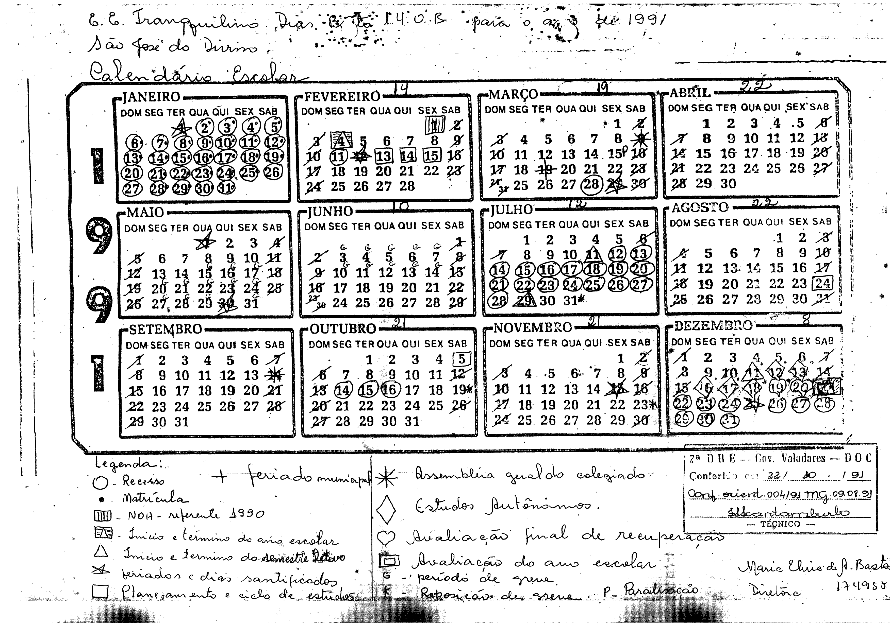

# Greves / Paralisações e similares

## 1991

## 1. Greve / Paralisação
+ Paralisação: 15-03-1991 (01 dia letivo);
+ Greve: De 08-05-1991 à 14-06-1991 (22 dias letivos);
---

### 1.1 Normas Legais e/ou Orientações
+ Orientação no 004/91, “MG” de 09/08/1991 (substituir a orientação no 002/91, de 08/07/1991);
+ Oficio circular no 03/91, de 17/07/1991 (SEE);
---

### 1.2 Procedimentos
+ Recomposição do calendário assegurando-se 180 dias letivos – encerramento do ano letivo de 1991 até 20/01/1992, no máximo (aprovação do órgão regional) – Direito à contagem de tempo após reposição;
---

### 1.3 Procedimentos executados
+ Foi eleborado e aprovado(conf. Orientação nº 004/91) um novo calendário, reduzindo de 200 para 180 o número de dias letivos;
+ Foram 22 dias letivos de greve, mais 01 dia letivo de paralisação, e com a aprovação da redução em 20 dias letivos para o ano, ficaram 03 dias para serem repostos;
+ A reposição dos dias pendentes ocorreu em:
    - 31-07-1991;
    - 19-10-1991;
    - 23-11-1991;
---

### 1.4 Calendário com reposição

>**1991:** Calendário / Reposição
---