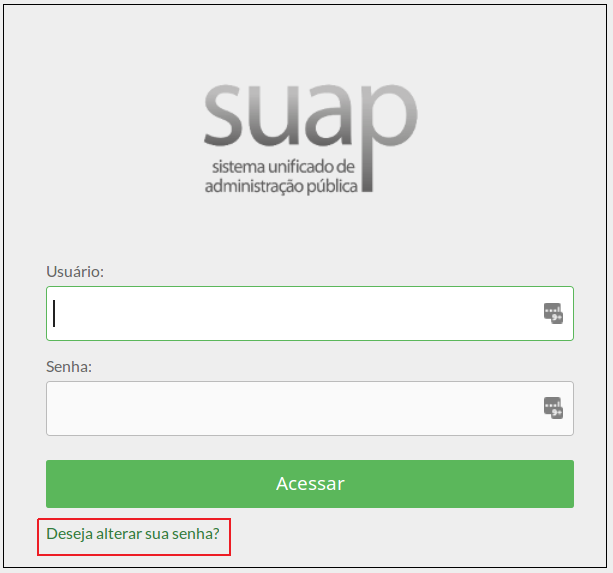
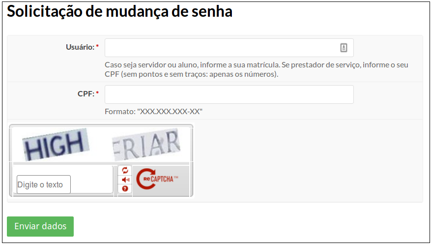
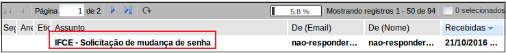
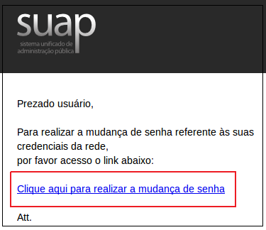
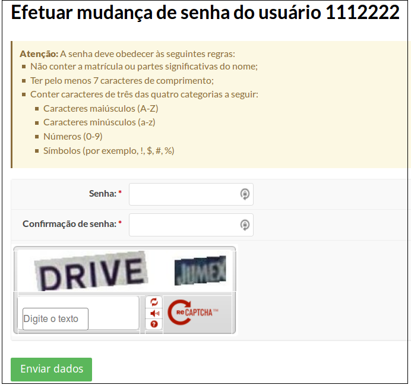

# Como recuperar minha senha?

## Passo 1

Clique no item **“Deseja alterar sua senha?”** localizado na parte inferior tela de login do **SUAP** (Figura1).

>**Figure 1:** Tela Login SUAP

## Passo 2

Você será encaminhado para a tela Solicitação de mudança de senha (Figura 2):

>**Figure 2:** Tela de Recuperação de Senha SUAP

Nesta tela:

a) informe seu login. Este será:

* **sua matrícula SIAPE**, se você for servidor ou estagiário;
* **seu CPF**, se você for Prestador de Serviço (o CPF deve ser digitado sem ponto e sem traços);
* **matrícula acadêmica**, se você for aluno.

b) digite as palavras que aparecem na imagem (captcha).
  
c) clique no botão **“Enviar”**.

No topo da tela, Aparecerá uma mensagem semelhante a:

**“Foi enviado um email para seu-email@ifce.edu.br com as instruções para realizar a mudança de senha.”**

Uma mensagem será enviada ao e-mail de recuperação de senha que foi cadastrado, contendo os passos para digitar uma nova senha.

## Passo 3 

Abra o seu e-mail e clique na mensagem “IFCE - solicitação de mudança de senha”, que foi enviada pelo SUAP (Figura3).

>**Figure 3:** Email de recuperação de senha

Clique no link “Clique aqui para realizar a mudança de senha” contido na mensagem (Figura 4).

>**Figure 4:** Link na mensagem de recuperação de senha

Na tela “Efetuar mudança de senha do usuário”, informe uma nova senha, obedecendo às regras descritas na tela (Figura 5).

>**Figure 5:** Link na mensagem de recuperação de senha

### Regras de preenchimento de senha

A senha deve obedecer às seguintes regras: 

* Não conter a matrícula ou partes significativas do nome;
* Ter pelo menos 7 caracteres de comprimento;
* Conter caracteres de três das quatro categorias a seguir:
  * Caracteres maiúsculos (A-Z)
  * Caracteres minúsculos (a-z)
  * Números (0-9)
  * Símbolos (por exemplo, !, $, #, %)

### Dicas de criação de uma senha segura

* Sua senha deve conter:
    * Mistura de letras, símbolos especiais e números, Para facilitar a decoração, você pode utilizar uma palavra como base, mas substituir alguns de seus caracteres. Por exemplo, em vez de usar **"marcos"** como senha, utilize **"M@rc0s"**. Repare que a palavra continua fazendo sentido para você e que os caracteres substitutos podem ser decorados sem muito esforço.

* Sua senha não deve conter:
    * caracteres em sequências (evite combinações como 123456, abcdef, 1020304050, qwerty)
    * datas especiais (aniversário, casamento, etc)
    * número da placa do carro
    * nomes e afins
