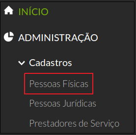
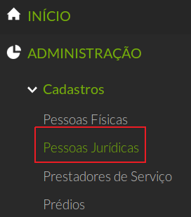

# Introdução

Antes de começarmos nosso passo a passo é necessário saber que:

**1) Os servidores NÃO deverão ser cadastrados como pessoa física:** Na maioria dos casos, quem precisará desse cadastro serão os prestadores de serviços ou pessoas que não são servidores desta instituição. Os servidores são obtidos por meio de importação de dados do SIAPENET, realizado semanalmente.

## Cadastro de Pessoa Física

Para cadastrar uma pessoa física clique no menu Administração → Cadastros → Pessoas Físicas.

>**Figure 1:** Menu Cadastrar Pessoa Física

Em seguida, no canto superior direito da tela, clique no botão “Adicionar Pessoa Física”. A tela “Pessoas Físicas” será exibida em seguida (Figura 2).

>**Figure 2:** Botão Cadastrar Pessoa Física

A Tabela a seguir descreve os campos contidos na tela de cadastro de Pessoa Física.
|Campo|Descrição|
| :----| :-----|
|nome|Nome completo da pessoa|
|Sexo|Masculino ou feminino|
|CPF|Os números do CPF. Não é necessário digitar ponto nem hífen, pois o SUAP formata o campo automaticamente|
|Data de nascimento|Formato: dia/mês/ano. Também é disponibilizado um calendário para a seleção da data.|
|Telefone|Número de telefone. Clique na opção "Adicionar outro(a) telefone" caso a pessoa possua mais de um telefone.|
 
## Cadastro de Pessoa Jurídica

Para cadastrar uma pessoa Jurídica, clique no menu Administração → Cadastros → Pessoas Jurídicas (Figura 3).

>**Figure 3:** Menu Cadastrar Pessoa Jurídica

Em seguida, no canto superior direito, clique em “Adicionar Pessoas Jurídicas” (Figura 4). A tela “Pessoas Jurídicas” será exibida em seguida

>**Figure 4:** Botão Adicionar Pessoa Jurídica?800

A Tabela a seguir descreve os campos do cadastro de Pessoa Jurídica.
|Campo|Descrição|
| :----| :-----|
|Nome|Nome ou Razão social da pessoa jurídica|
|CNPJ|Número do CNPJ. Não é necessário digitar ponto, barra ou hífen, pois o SUAP formata o campo automaticamente|
|Email principal|Email da pessoa jurídica|
|Inscrição estadual|Inscrição estadual da pessoa jurídica|
|Website|Endereço da página web da pessoa jurídica|
|Telefone|Número de telefone. Clique na opção "Adicionar outro(a) telefone" caso a poessoa possua mais de um telefone|

--------------------
