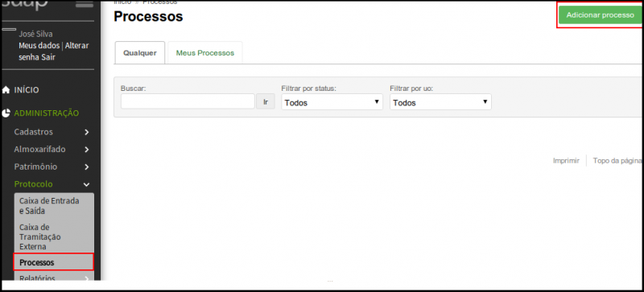
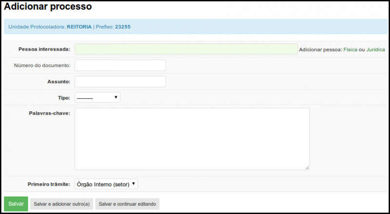
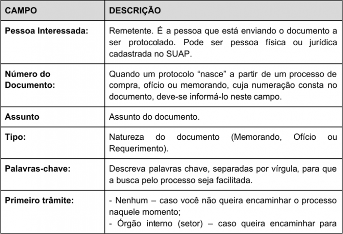
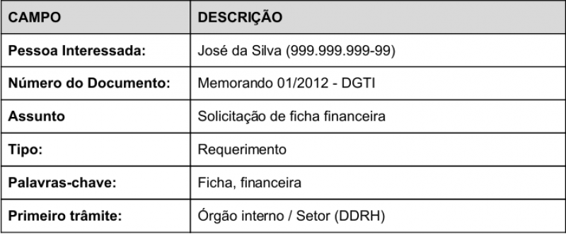

# SUAP/Protocolo/Manual do Usuário/Cadastro do processo
## Passo-a-passo

Para cadastrar um processo no SUAP clique no menu Administração → Protocolo → Processos. Em seguida, no canto superior direito da tela clique no botão “Adicionar Processo” (Figura 1). A tela “Adicionar processo” será exibida em seguida (Figura 2).

>**Figura 1:** Processos

>**Figura 2:** Tela de cadastramento de processos 

A Tabela 3 descreve os campos do cadastro de processo.

>**Figura 3:** Campos: adicionar processo

 Tabela 4 apresenta um exemplo de cadastro de um processo.
 
>**Figura 4:** Exemplo de preenchimento dos campos de processo 