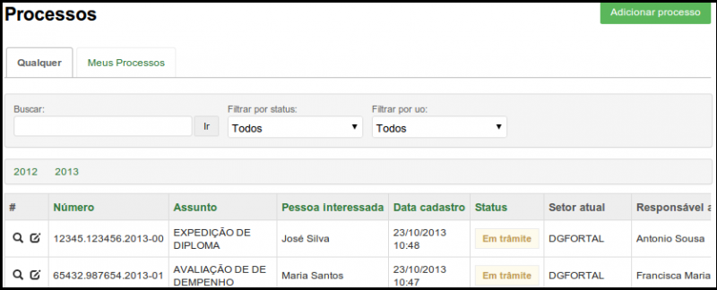
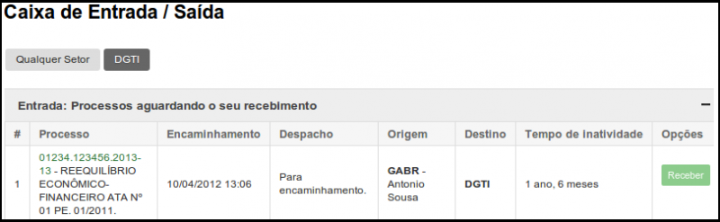

# SUAP/Protocolo/Manual do Usuário/Listar processos

## Listar processos

Para visualizar os dados de todos os processos cadastrados, clique no menu Administração → Protocolo → Processos e clique na aba “Qualquer”. Você será redirecionado para a tela a seguir (Figura 1):

>**Figura 1:** Listar todos os processos

Para visualizar todos os processos em que você é a pessoa interessada, clique no menu Administração → Protocolo → Processos e clique na aba “Meus processos”. Você será redirecionado para a tela a seguir (Figura 2):

>**Figura 2:** listar meus processos

Para visualizar mais informações acerca do processo, basta clicar na lupa localizada à
esquerda do número do processo. 
