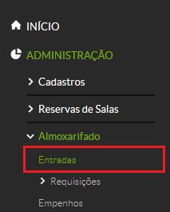
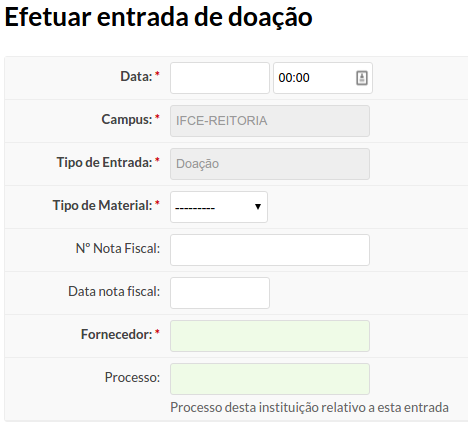
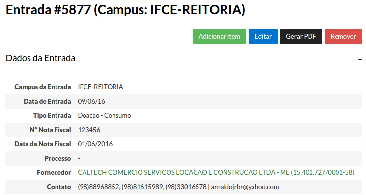
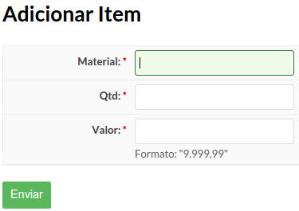
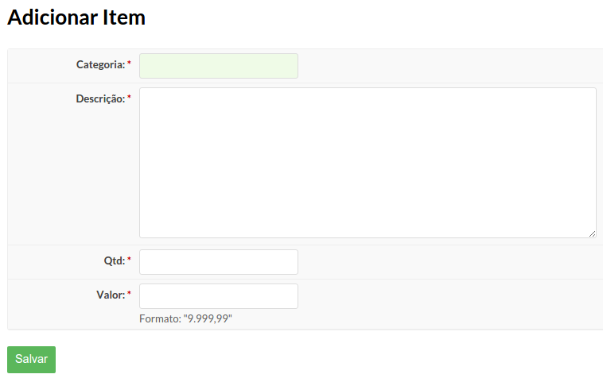

# 5.7. SUAP/Almoxarifado - Registrar entrada de material (doação)

## 5.7.1 Conceitos

|Conceito|Definição|
| :------| :-------|
|DOAÇÃO| modalidade em que bens são recebidos gratuitamente, provenientes de qualquer instituição pública ou privada; |

## 5.7.2 Cadastrar entrada de material por doação

Para cadastrar uma entrada de material, clique no menu “**Administração**”, menu “**Almoxarifado**”, e por fim clique em “**Entradas**” (Figura 1).

>**Figure 1:** Menu entrada de material

Na tela seguinte, clique no botão “Adicionar Doação” (Figura 2).

>**Figure 2:** Botão Adicionar Doação

Será exibido o seguinte formulário (Figura 3):

>**Figure 3:** Formulário de cadastro de doação

| Campo | Descrição | Obrigatório |
| :------| :-------| :------|
| Data: | a data que a entrada de doação está sendo efetuada. | SIM |
| Campus: | Campus do servidor que está efetuando a doação. Este campo é preenchido automaticamente. | SIM |
| Tipo de de entrada: | Doação (preenchido automaticamente). | SIM |
| Tipo de material: | selecione entre: permanente ou consumo. | SIM |
| N° Nota Fiscal: | Número da Nota Fiscal. É possível digitar mais de um número de nota fiscal, separando-os por ponto-e-vírgula (ex: 31012;315016).  | NÃO |
| Data Nota Fiscal: | Data da Nota Fiscal. | NÃO |
| Fornecedor: | Fornecedor do material. | SIM |
| Processo: | Processo da instituição relativo a esta entrada de doação. | NÃO |

Após clicar em **“Salvar”** você deve adicionar os itens da doação. Para isso, na tela que segue, clique no botão **“Adicionar item”** (Figura 4).

>**Figure 4:** Adicionar item da doação 

## 5.7.3 Adicionar item à doação de um bem de consumo

Se a doação for referente a um bem de consumo, aparecerá o seguinte formulário (Figura 5):

>**Figure 5:** Formulário de cadastro de item da doação - bem de consumo

Preencha os seguintes campos:

| Campo | Descrição | Obrigatório |
| :------| :-------| :------|
| Material: | Descrição do material doado. | SIM |
| Qtd: | quantidade do material doado. | SIM |
| Valor: | valor do material doado. | SIM |

## 5.7.4 Adicionar item à doação de um bem permanente

Se a doação for referente a um bem permanente, aparecerá o seguinte formulário (Figura 6):

>**Figure 6:** Formulário de cadastro de item da doação - bem permanente

Preencha os seguintes campos:

| Campo | Descrição | Obrigatório |
| :------| :-------| :------|
| Categoria: | categoria do material doado. | SIM |
| Descrição: | Descrição do material doado. | SIM |
| Qtd: | quantidade do material doado. | SIM |
| Valor: | valor do material doado. | SIM |