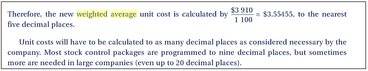

# 5.8. SUAP/Almoxarifado - Metodologia de Controle de Estoque (PEPS e Média Ponderada)

## 5.8.1 Introdução

Vários fatores podem influenciar os preços de todo tipo de mercadoria: concorrência, variações nos índice geral de preços, impostos, etc. Sendo assim, dificilmente teremos durante o período compras feitas pelo mesmo preço.

Normalmente este preço vai variar muito, dando origem ao problema de avaliação de inventário.

A grande questão que define o método de avaliação dos estoques é: como valorizar as saídas quando houver variação no custo das entradas?

É para responder a esta questão que se aplicam os diferentes critérios de avaliação dos Estoques, tais como PEPS, UEPS e Média Ponderada, sendo este último o mais utilizado e previsto pela legislação brasileira.

## 5.8.2 PEPS

A baixa no custo do estoque se dá pela seguinte maneira: o primeiro que entra é o primeiro que sai.

Retira-se primeiro do estoque aqueles itens que entraram primeiro. Isso significa que, quando é feita uma retirada de produtos do estoque para venda ou consumo interno, deve-se considerar o valor dos itens mais antigos que ainda estão no estoque.

Exemplo:  

  * 01/01: estoque inicial: 100 unidades a um custo de aquisição de R$ 100,00, totalizando R$ 10.000,00
  * 05/01: aquisição de 50 unidades a um custo de aquisição de R$ 133,00, totalizando R$ 6.650,00.
  * 12/01: retirada de 110 unidades.
      * 100 unidades a um custo de R$ 100,00 = R$ 10.000,00
      * 10 unidades a um custo de R$ 133,00 = R$ 1330,00

Este foi o sistema inicialmente utilizado para o cálculo dos valores de entrada e saída do almoxarifado no SUAP, mas que não se encontra mais em uso pelo IFCE.

## 5.8.3. Custo médio poderado 

Existe a possibilidade de se dar como custo o valor médio das compras, que será usado para todas as saídas a partir de uma nova entrada.

Cada entrada (a preço unitário diferente do preço médio anterior) modifica o preço médio;

No  método  do  custo  médio  ponderada  há uma  fusão  das  quantidades  monetárias  decorrentes  de  novas  compras  com  o  custo  total  do  que existia em estoque  antes da  compra. 

Esse método é o mais utilizado pelas companhias do Brasil.

**Este é o atual método de mensuração e avaliação das saídas do estoque do SUAP (a partir de de novembro de 2016)**, em conformidade com a Lei n 4.320/64 e Resolução CFC n 1137/08 que aprova a NBCT 16.10 - Avaliação e Mensuração de Ativos e Passivos em Entidades do setor público.

Cada  entrada  é  recalculado  o  valor  médio  do  material  no  estoque  com  a  seguinte  fórmula:

valor  médio  =  (  (A  *  B)  +  (C  *  D)  )  /  (B  + D) 

  * A  = valor  médio  anterior
  * B  = quantidade  em  estoque
  * C  = valor  do  material  que  está  entrando  no  almoxarifado
  * D = quantidade  do  material  que  está  entrando  no  almoxarifado
  * B + D = soma das quantidades de estoque e entrada.

Exemplo:

  * Entrada: 30 unidades, custo unitário de R$ 1.200.000
  * Entrada: 10 unidades, custo unitário de R$ 420.000

Primeiro passo: Somamos a quantidade existente no estoque com a quantidade da Entrada:
30 + 10 = 40

Segundo passo: somamos o valor do estoque com o valor da entrada:
1.200.000 + 420.000 = 1.620.000,00

Terceiro passo: dividir o saldo novo pela quantidade total
1.620.000,00 / 40 = 40.500,00

Quando há uma saída de produtos, eles saem pelo custo médio (R$ 40.500,00).

## 5.8.4 Quantidade de casas decimais

O SUAP, em sua versão original (IFRN) trabalha com quatro casas decimais.

Mas no livro **Management Accounting: Principles & Applications** de Jill Hart,Clive Wilson,Chris Fergus, os autores citam casos de que pode-se haver a necessidade de uso maior de casas decimais.

Na prática, o uso de quatro casas decimais pode ocasionar problemas no arredondamento, gerando uma diferença de centavos quando há movimentações de grandes quantidades.

Para resolver este problema, adotou-se o cadastro de movimentações com seis casas decimais.
E no Relatório Mensal do Almoxarifado, são exibidas apenas duas (sendo esta a quantidade de casas utilizada pelo SIAFI).
