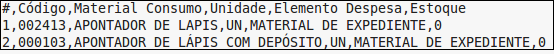
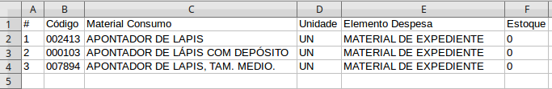
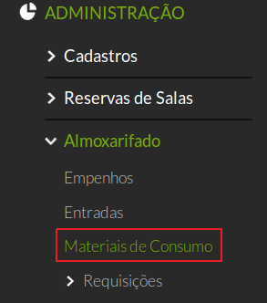
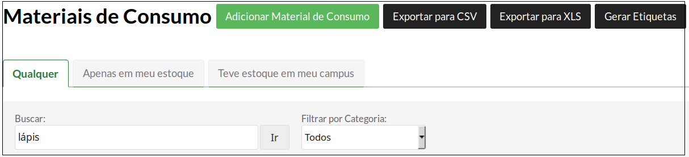
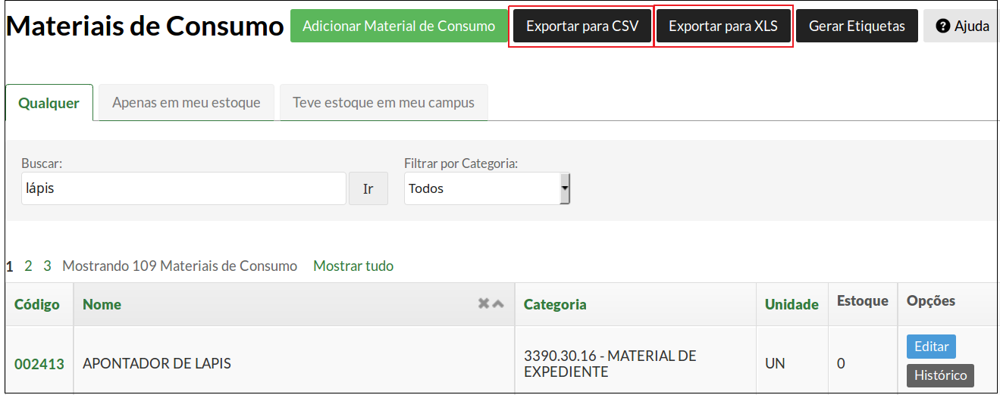

# 5.12. SUAP/Almoxarifado - Material de consumo (exportação para CVS e XLS)

## 5.12.1 Introdução

O SUAP dá a possibilidade de gerar uma listagem contendo os dados dos materiais de consumo em um arquivo comma-separated values(CSV) ou planilha XLS.

Um arquivo CSV é aquele cujos dados encontram-se separados por vírgula.

Um arquivo XLS é aquele cujos dados encontram-se formatados em uma planilha.

## 5.12.2 Perfis de acesso

A funcionalidade **Exportação de materiais para CVS ou XLS** está disponível para usuários pertencentes ao(s) seguinte(s) grupo(s):

  * Coordenador de almoxarifado do campus
  * Coordenador de almoxarifado sistêmico
  * Operador de almoxarifado do campus

## 5.12.3 Procedimento de exportação em CSV ou XLS

Clique em **ADMINISTRAÇÃO**, em seguida clique em **Almoxarifado** e depois clique na opção **Materiais de Consumo**.

Na tela que aparece, clique no campo **Buscar** e preencha com o nome do material que será exibido ou deixe vazio para exibir todos (aperte **ENTER** ou clique no botão **Ir**).

Após ter feita a busca, o próximo passo é clicar no botão **Exportar para CSV** ou **Exportar para XLS**, localizado no canto superior direito da tela.

Um arquivo será gerado para download.