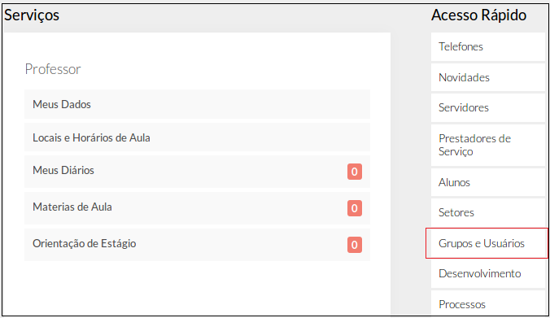
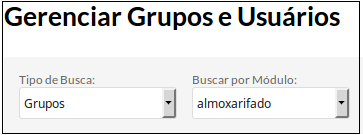
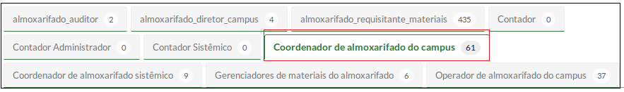
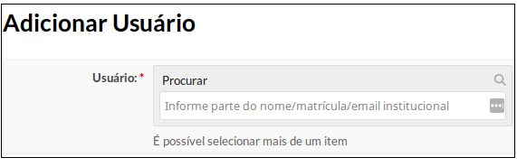

# SUAP/Almoxarifado - Perfis de acesso

## 3.7.1 - Descrição dos perfis

|Perfil|Descrição|Destinado a|
| :----| :-------| :---------|
|almoxarifado Administrador|Conceder perfis de acesso aos usuários para acesso ao módulo de Almoxarifado|Coordenador de Almoxarifado de cada campus|
|almoxarifado_diretor_campus|Visualizar empenhos; Buscar e visualizar entradas; Ver relatórios de seu campus;|Diretores de campus|
|almoxarifado_requisitante_materiais|Visualizar requisições de seu campus; Adicionar requisições de material;|Servidores com função gratificada ocupante de Coordenação. |
|Coordenador de almoxarifado do campus|Visualizar, adicionar, alterar e excluir empenhos; Buscar e visualizar entradas; Adicionar materiais de consumo; Adicionar e alterar Pessoa Jurídica; Adicionar e alterar requisição do campus; Ver requisições do campus; Ver relatórios do campus; Adicionar e alterar números de telefones|Coordenador de Almoxarifado de cada campus|
|Coordenador de almoxarifado sistêmico|Adicionar e alterar elementos de despesa; Visualizar, adicionar, alterar e excluir empenhos; Buscar e visualizar entradas; Adicionar e alterar materiais de consumo; Ver relatórios dos campi; Adicionar e alterar unidades de medida; Adicionar e alterar números de telefone; Adicionar e alterar Pessoa Jurídica; Adicionar e alterar requisição do campus; Ver requisições dos campi;|Coordenador de almoxarifado da Reitoria |
|Operador de almoxarifado do campus|Visualizar, adicionar, alterar e excluir empenhos; Buscar e visualizar entradas; Adicionar materiais de consumo; Ver relatórios do campus; Ver requisições do campus; Adicionar e alterar números de telefone; Adicionar e alterar Pessoa Jurídica;|servidor lotado em Coordenação de Almoxarifado de cada campus (desde que não sejam coordenadores)|
|Gerenciadores de materiais do almoxarifado|Adicionar e alterar materiais de consumo|-|
|Auditor de almoxarifado|Buscar e visualizar entradas; Ver relatórios dos campi; Ver requisições dos campi|-|

## 3.7.2 - Atribuindo os perfis do módulo de Almoxarifado a um usuário

Na tela inicial, clique na opção **"Grupos e Usuários"**, localizado no lado direito da tela (Figura 1)

>**Figure 1:** Menu “Grupos e Usuários”

Na tela **"Gerenciar Grupos e Usuários"**, selecione o módulo **"almoxarifado"** (Figura 2).

>**Figure 2:** Selecionar módulo “Almoxarifado”

Clique na aba contendo o perfil desejado (por exemplo, **Coordenador de Almoxarifado do Campus**) (Figura 3)

>**Figure 3:** Perfis do módulo Almoxarifado

Clicar no botão Adicionar usuário ao grupo (Figura 4) 

>**Figure 4:** Botão “Adicionar usuário ao grupo”

Procure o usuário pelo nome ou pela matrícula SIAPE (Figura 5)

>**Figure 5:** Localizar usuário

Selecione o usuário clicando nos seus dados e confirme (Figura 6)