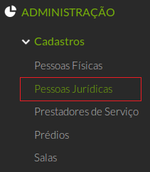
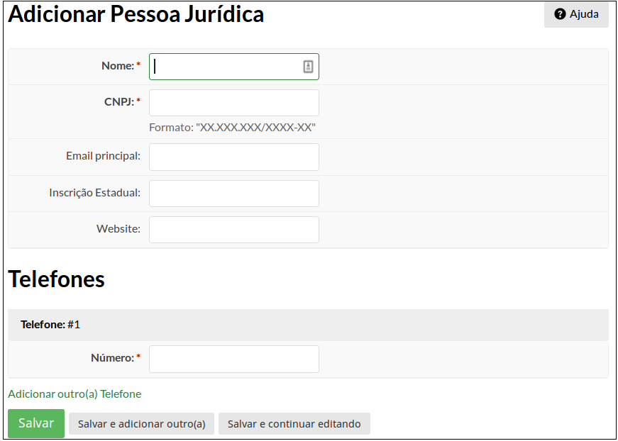

# 3.3. SUAP/Patrimônio - Cadastrar fornecedores

## 3.3.1. Perfis

A funcionalidade **Cadastrar Fonecedor/Cadastrar Pessoa Jurídica** está disponível para usuários pertencentes ao(s) seguinte(s) grupo(s):

  * Coordenador de almoxarifado do campus
  * Coordenador de almoxarifado sistêmico
  * Coordenador de patrimônio do campus
  * Coordenador de patrimônio sistêmico
  * Operador de almoxarifado do campus
  * Operador de patrimônio do campus

## 3.3.2. Procedimento para cadastro de Fornecedores

Para cadastrar um fornecedor, clique no menu **Administração** → **Cadastros** → **Pessoas Jurídicas** (Figura 1).

>**Figure 1:** Menu de cadastro de Pessoas Jurídicas

Em seguida, no canto superior direito, clique no botão “Adicionar Pessoas Jurídicas” (Figura 2).

>**Figure 2:** Menu de cadastro de Pessoas Jurídicas

O formulário para cadastro de Pessoas Jurídicas será exibido em seguida (Figura 3).

>**Figure 3:** Formulário de cadastro de Pessoas Jurídicas

Nessa tela deverão ser informados os seguintes campos:

| Campo | Descrição | Obrigatório |
| :-----| :---------| :-----------|
|**UG Emitente**| Corresponde a Unidade Gestora Emitente (ex: IFCE-REITORIA, IFCE-FORTALEZA, IFCE-SOBRAL). | SIM |

Concluído o preenchimento dos campos, escolha um dos três botões abaixo:

|       |           |             |
| :-----| :---------| :-----------|
|**Salvar:**|Salva a pessoa jurídica no sistema e retorna para a página anterior.|
|**Salvar e adicionar outro(a):**|Salva a pessoa jurídica no sistema e limpa o formulário para que mais uma pessoa jurídica possa ser cadastrada.|
|**Salvar e continuar editando:**|Salva a pessoa jurídica no sistema e continua na mesma página para que uma nova alteração seja realizada, se necessário.|