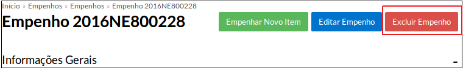
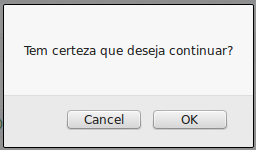
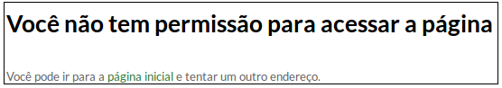

# 4.3. SUAP/Patrimônio - Excluir empenhos

## 4.3.1. Pré-requisitos

Para proceder com a exclusão de empenhos, é necessário:
  * o cadastro prévio de um ou mais empenhos.
  
## 4.3.2. Perfis de acesso

A funcionalidade "Excluir empenho" está disponível para usuários pertencentes aos seguintes perfis de acesso:

  - Coordenador de almoxarifado do campus
  - Coordenador de almoxarifado sistêmico
  - Operador de almoxarifado do campus
  
## 4.3.3. Procedimento de exclusão de empenho

Para excluir um empenho, faça a localização deste conforme descrito 

Ao clicar no ícone da lupa (para a visualização dos detalhes do empenho), clique no botão "Excluir empenho" localizado no topo superior direito da tela.

Será exibida uma tela de confirmação de exclusão. Clique em "OK".

OBS: caso o seu usuário não tenha permissão para excluir o empenho, a seguinte tela será exibida:

