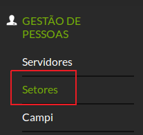
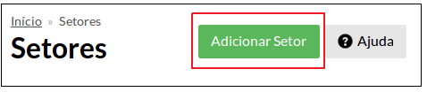

# SUAP/Gestão de Pessoas/Manual do usuário/Cadastrar setor

Clique no menu **“Gestão de Pessoas”** → **“Setores”** (Figura 8).

>**Figure 1:** Menu Setores

Clique no botão Adicionar Setor (Figura 9).

>**Figure 2:**  Botão Adicionar Setor

No formulário **Adicionar Setor**, preencha os seguintes campos conforme as orientações a seguir:

|Campo|Descrição|
| :---| :-------|
|Código SIAPE|Deixar em branco, não preencher|
|Setor Superior|Selecionar o setor ao qual será vinculado|
|Sigla|Inserir uma pequena sigla para identificação no sistema. Mantenha o padrão sigla/campus (Ex: ACAEAE/FORTAL, DGTI/REITORIA)|
|Nome|Descrever o setor|
|Excluido|Deixar desmarcado|
|Setores compartilhados|Geralmente não é preenchido, ao menos que você queira estabelecer um vínculo entre setores para fins de protocolo|
|Código SIORG|Não preencher|
|Áreas de Vinculação|Não preencher|
