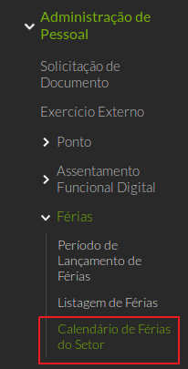
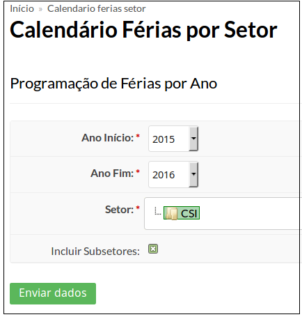
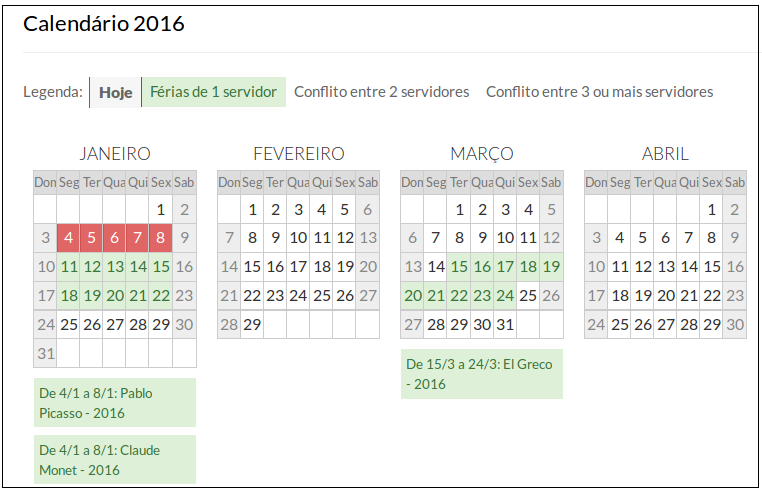

# SUAP/Gestão de Pessoas/Manual do usuário/Calendário de férias por setor

## a) Observações

O histórico de férias é adquirido por meio de importação de dados do SIAPENET, realizada semanalmente pela DGTI. (<importar_historico_ferias>)

## b) Consulta ao calendário

O Calendário de férias pode ser visualizado ao clicar no menu Gestão de Pessoas → Administração de Pessoal → Férias → Calendário de Férias por Setor (Figura 1).

>**Figure 1:** Menu Calendário de Férias do Setor

Na tela que segue (Figura 2), selecione o período (Ano início e Ano Fim), o setor e marque a opção “Incluir Subsetores” nos casos em que um setor possua divisões (Por Ex: Pró-Reitorias, Diretorias, etc).

>**Figure 2:** Escolha do período de férias

Será exibido um relatório em formato de calendário, contendo o período de férias informado e as datas de cada sevidor (Figura 3).

>**Figure 3:** Exibição do calendário

As férias estarão agrupadas por anos.

Os dias correspondentes às férias do servidor estarão marcados pela cor verde e terão o nome do servidor abaixo do calendário com os seus dias respectivos.

Quando dois servidores estiverem com dias em comum, uma cor vermelha irá preencher o dia.

Caso haja três ou mais servidores, a cor vermelha será mais intensa.
