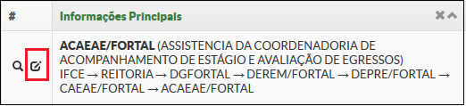

# SUAP/Gestão de Pessoas/Manual do usuário/Editar setor

**OBS:** Para editar os dados você precisa estar com o perfil **Coordenador de RH Sistêmico**.

Na lista de setores, no lado esquerdo do nome do setor, existe o ícone de um lápis, para edição das informações do setor (Figura 7).

>**Figure 1:** Edição dos daodos dos setores

Estas informações também podem ser agrupadas em dois tipos: informações sobrescritas na importação e não sobrescritas na importação.

São sobrescritas todas as informações apresentadas exceto: telefones e setores compartilhados.
