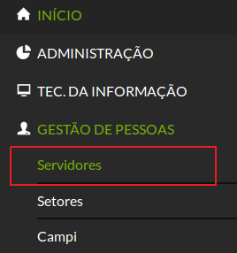
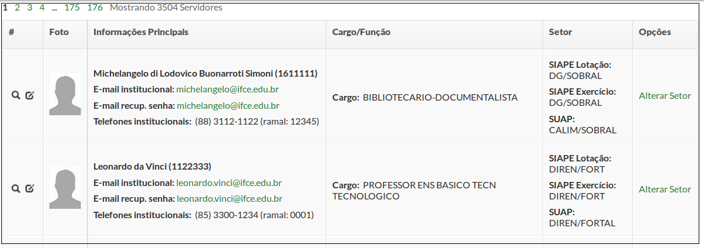
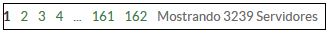
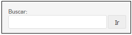
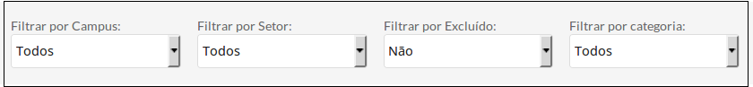
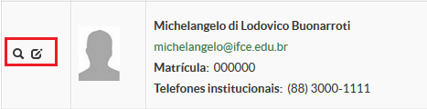
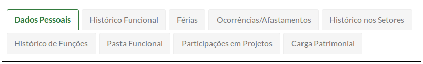

# SUAP/Gestão de Pessoas/Manual do usuário/Servidores

## Visão geral

A listagem de servidores é exibida ao clicar no menu **“Gestão de Pessoas”** → **“Servidores”** (Figura 1).

>**Figure 1:** Menu Servidores

Aparecerá uma lista de todos os servidores e estagiários, paginados a 20 registros por vez (Figura 2).

>**Figure 2:** Visão geral da tela de servidores

## Paginação

Para visualizar outros registros, navegue clicando no link da página contendo seu respectivo número (Figura 3).

>**Figure 3:** Paginação de resultados da tela de servidores

## Busca

Será possível executar busca por nome ou matrícula do Servidor usando o campo “Buscar”.

>**Figure 4:** Campo de busca da tela de servidores

## Filtros

Para filtrar os dados encontrados, utilize as caixas de seleção:
* Filtrar por Campus (Unidades Organizacionais/Campus)
* Filtrar por Setor
* Filtrar por Excluído (do SIAPE)
* Filtrar por Categoria (Técnico-Administrativo / Docente)

>**Figure 5:** Filtrando resultados na tela de servidores

## Ícones (lupa e lápis)

Na lista de servidores, no lado esquerdo da foto do servidor, existem dois ícones (Figura 6):
* uma lupa, que possibilita a visualização das informações do servidor (de acordo com as permissões do usuário);
* um lápis, que disponibiliza a alteração de alguns dados do servidor.
    

>**Figure 6:** Ícones de visualização e edição

Ao clicar na lupa, será aberta uma tela, que está dividida em abas. 

|Aba|Descrição|
| :-------| :------|
|Dados Pessoais|Referentes à ficha cadastral do servidor junto ao SIAPE|
|Histórico Funcional|Exibe uma linha de tempo, contendo as ocorrências de Provimento de Cargo (PCA); e módulo do SIAPEcad, que permite o registro e o gerenciamento dos cargos ocupados pelos servidores (MPOG, 2009)|
|Férias|Exibe os anos e os períodos de férias registradas no SIAPE, desde 1994|
|Ocorrências/Afastamentos| Exibe as datas de: Inclusão no Serviço Público, Inclusão no órgão e Licenças (Tratamento de Saúde, Doença Pessoa Familia, Paternidade, etc.)|
|Histórico nos setores| Subdivide-se em: a) Histórico de setores SUAP, que registra as movimentações desde a implantação do sistema; b) Histórico de setores SIAPE que, por meio da importação do SIAPE, mostra todas as movimentações do servidor lá registradas.|
|Histórico de funções| Exibe as datas e informações a algum cargo de coordenação ou direção ocupados no IFCE |
|Pasta funcional| Área destinada à visualização dos arquivos carregados na pasta funcional do servidor.
|Participação em Projetos|Exibe informações sobre: Projetos de Extensão e Projetos de Pesquisa.|
|Carga patrimonial|Exibe os inventários de posse do servidor|

Além das abas, haverá botões exibidos de acordo com as permissões do usuário, sendo os principais disponíveis para RH:|

|Opção Editar|Descrição|
| :-------| :------| :----|
|Editar → Email| Usado para informar: E-mail Secundário, E-mail Institucional, E-mail Acadêmico, E-mail Google ClassRoom|
|Editar → Servidor| Usado para informar o nome usual e setor de lotação do servidor|
|Editar → Usuário| Usado para informar os grupos e permissões do usuário|

Essas informações podem ser agrupadas em dois tipos: informações sobrescritas na importação e informações não sobrescritas na importação do SIAPE.
Informações sobrescritas na importação são aquelas que, toda vez que for feita uma importação do SIAPE, serão substituídas pelas contidas no SIAPE. São sobrescritas todas as informações apresentadas exceto: Nome Usual, Foto e Setores Adicionais.