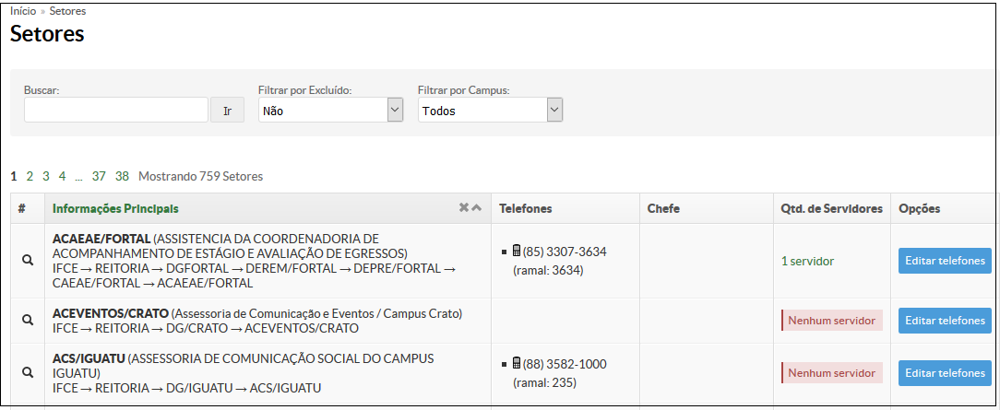
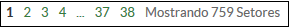
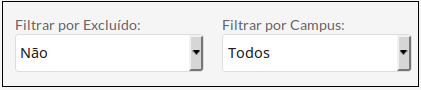
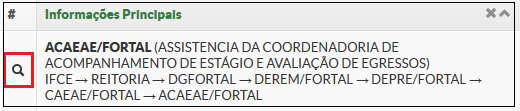

# SUAP/Gestão de Pessoas/Manual do usuário/Setores

## a) Listagem de setores

A lista de todos os Setores é exibida ao clicar no menu **“Gestão de Pessoas”** → **“Setores”** (Figura 1).

>**Figure 1:** Menu Setores

Na tela Setores (Figura 2), será exibida uma lista de setores, detalhados por:
* sigla
* descrição
* setor superior, a que está vinculado
* telefones
* Coordenador do setor
* servidores que estão lotados o nome do responsável
* Opções.

>**Figure 2:** Lista de setores

## b) Paginação

Por padrão são listados 20 registros por vez.

Para visualizar os demais registros, navegue clicando no link da página contendo seu respectivo número (Figura 3).

>**Figure 3:** Paginação de resultados dos setores

## c) Busca

Utilize o campo “Buscar” para localizar um setor por nome ou por sigla (Figura 4).

>**Figure 4:** Paginação de resultados dos setores

## d) Filtragem de dados

Utilize as caixas de listagem **Filtrar por Excluído**, para exibir os setores inativos, e **Filtrar por Campus**, para exibir os setores de um campus específico (Figura 5). 

>**Figure 5:** Filtro de setores

## e) Exibição dos dados do setor

Na lista de setores, no lado esquerdo do nome do setor, existe o ícone de uma lupa, para visualização das informações do setor (Figura 6).

>**Figure 6:** Exibição dos dados dos setores