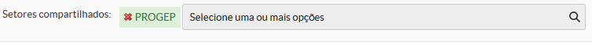
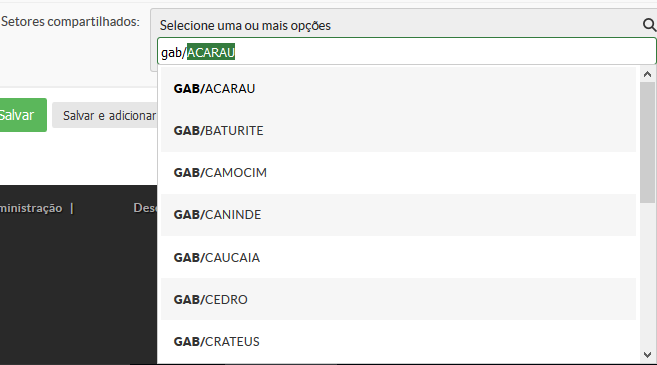

# SUAP/Gestão de Pessoas/Manual do Usuário/Setores compartilhados

## Visão geral

Setores compartilhados são todas as unidades organizacionais às quais o setor que estamos editando terá acesso. Porém algumas funções estarão limitadas. 

Esta funcionalidade é útil na tramitação de processos. 

No exemplo a seguir, editamos o setor PROAP e definimos o setor PROGEP como compartilhado. A partir de então, todos os processos enviados à PROGEP também poderão ser movimentados pelos servidores lotados na PROAP.

Para cadastrar setores compartilhados, basta digitar o Nome ou a Sigla do setor e o sistema listará os setores encontrados com o autocompletar. Em seguida clique na sigla desejada, dentre as listadas, e salvar.

**Importante:** É possível adicionar mais de um setor. 