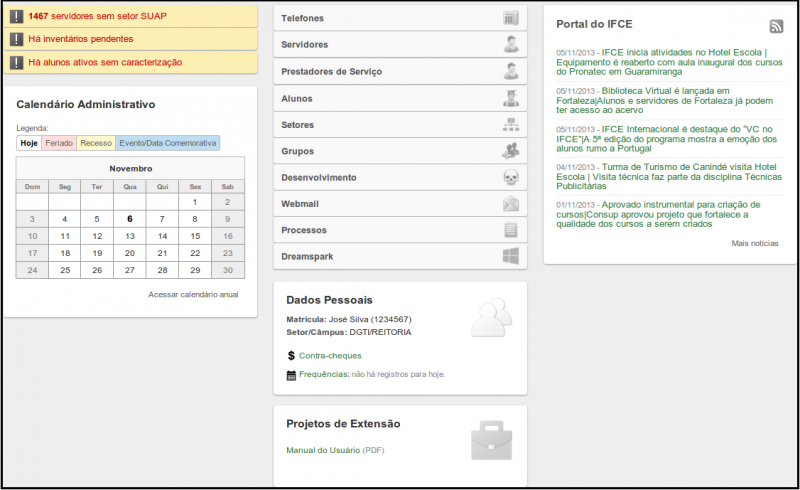
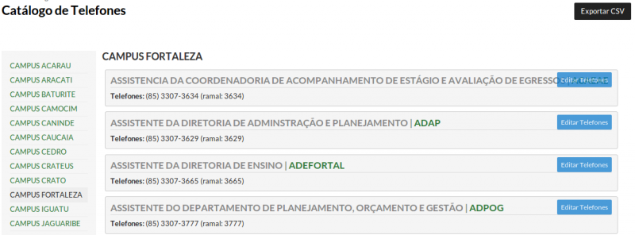
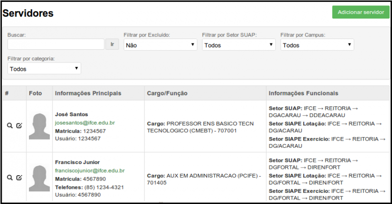
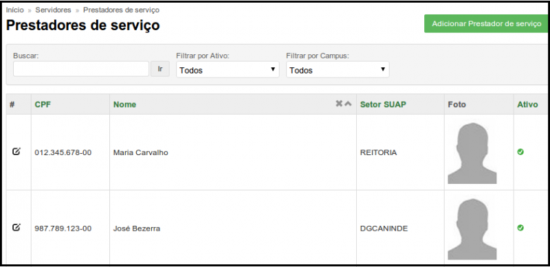
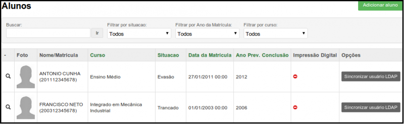
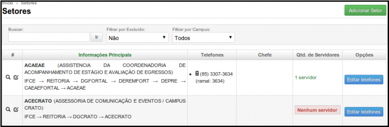
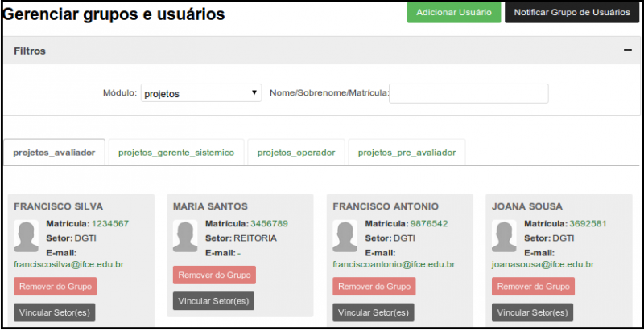
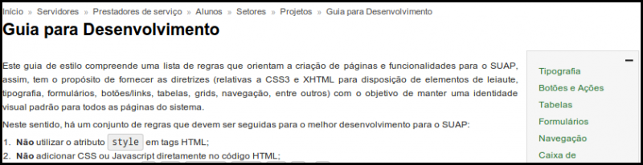
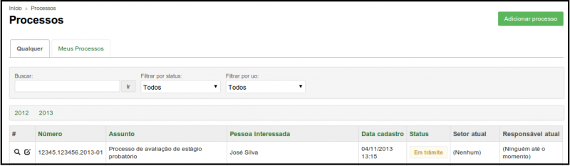

# Tela inicial

A Figura 1 ilustra a tela inicial do SUAP, onde você terá acesso a diversas funcionalidades, organizadas em seções, que serão descritas a seguir. 

>**Figura 1:** Tela principal do SUAP

## Seções da tela inicial

### Avisos

​Essa seção mantém o usuário informado por meio de avisos importantes emitidos pelos módulos em produção.

### Calendário Administrativo

​Essa seção apresenta o calendário administrativo contendo feriados, recessos e datas comemorativas.

### Serviços

Essa seção disponibiliza informações sobre os telefones, os servidores, os prestadores de serviço, os alunos, os setores, os usuários e seus perfis, um guia a ser seguido pela equipe de desenvolvimento do SUAP, acesso ao Webmail institucional, os processos da Instituição e um link para acesso ao DreamSpark (Web Store onde os alunos e professores poderão realizar o download dos produtos Microsoft gratuitamente).

### Dados pessoais

​Essa seção exibe seu número de matrícula, o ​campus e o setor ao
qual você pertence. Além disso, há um link para acessos aos contracheques e outro para acesso ás frequências.

### Projetos de Extensão

Essa seção disponibiliza arquivos advindos do módulo de Projetos de Extensão.

### Portal do IFCE

​Essa seção exibe as notícias em destaque do sítio do IFCE.

## Seção Serviços

### Seção Telefones

Aqui teremos o acesso aos telefones dos setores de todos os ​campi do IFCE (Figura 2). Na caixa à esquerda é possível filtrar por qual ​campus ​você deseja consultar os telefones.

>**Figura 2:** Catálogo de Telefones

### Seção Servidores

Essa página exibe informações sobre os servidores dos campi (Figura 3). Ela nos fornece qual o cargo, onde o servidor está lotado e seu número de matrícula no SIAPE. Na barra superior você pode fazer uma busca pelo nome ou pela matrícula do SIAPE.

>**Figura 3:** Seção Servidores

### Seção Prestadores de serviço

Essa página exibe informações sobre os prestadores de serviço dos campi (os terceirizados que utilizarão o SUAP, como por exemplo, as recepcionistas). Ela nos fornece qual o CPF, o nome e o setor onde ele está alocado (Figura 4). Na barra superior você pode fazer uma busca pelo nome ou pelo CPF.

>**Figura 4:** Prestadores de serviço 

### Seção Alunos

Essa página exibe informações sobre os alunos dos campi.

>**Figura 5:** Aluno

### Seção Setores

Nessa página você terá acesso a uma lista com informações sobre todos os setores dos ​campi ​como, por exemplo, qual o telefone e os servidores que lá trabalham (Figura 6).

>**Figura 6:** Setores

### Seção Grupos

Essa página permite gerenciar grupos e usuários (figura 7).

>**Figura 7:** Gerenciar grupos e usuários

### Seção Desenvolvimento

Essa página exibe um guia para o desenvolvimento do sistema SUAP. Essa opção é destinada à equipe da DGTI responsável pela manutenção do sistema (Figura 8).

>**Figura 8:** Guia para desenvolvimento

### Seção Webmail

Este botão redirecionará você para fazer o login na sua conta de email institucional.

### Seção Processos

Essa página exibe a listagem de processos da instituição (Figura 9).

>**Figura 9:** Processos

### Seção Dreamspark

Aqui você poderá acessar o Dreamspark e poder fazer o download de softwares originais da Microsoft.
Observação: no momento esta opção não está disponível para uso no SUAP do IFCE. 