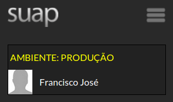
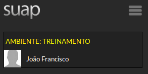

# Quais as diferenças entre SUAP Produção e SUAP Treinamento?

## Ambiente de produção

É o ambiente real, ou seja, o ambiente que você utilizará no dia-a-dia no IFCE para a realização dos trabalhos de sua função.

Seu acesso se dá por meio do link: [http://suap.ifce.edu.br/](http://suap.ifce.edu.br/)

Após efetuar o login no sistema, aparecerá no canto superior esquerdo a mensagem: “AMBIENTE: PRODUÇÃO” 

**OBS:** O Ambiente de Produção não deve ser utilizado para fins de capacitação de servidores. Para isto, utilize o Ambiente de Treinamento.

Ambiente de treinamento

É o ambiente utilizado na capacitação dos usuários nos módulos disponíveis no SUAP.

O Ambiente de Treinamento replica as funcionalidades do ambiente de produção. 

Seu acesso se dá por meio do link: [http://suaptreinamento.ifce.edu.br/](http://suaptreinamento.ifce.edu.br/)

 **OBS:** O Ambiente de Treinamento não deve ser usado no dia-a-dia para a realização dos trabalhos da sua função. Para isto, utilize o Ambiente de Produção.